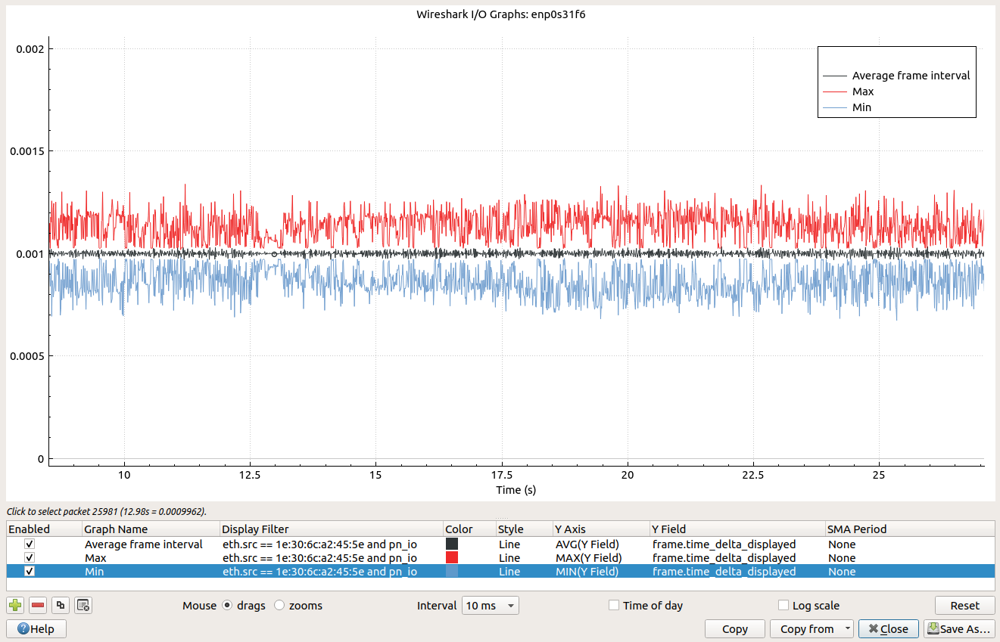
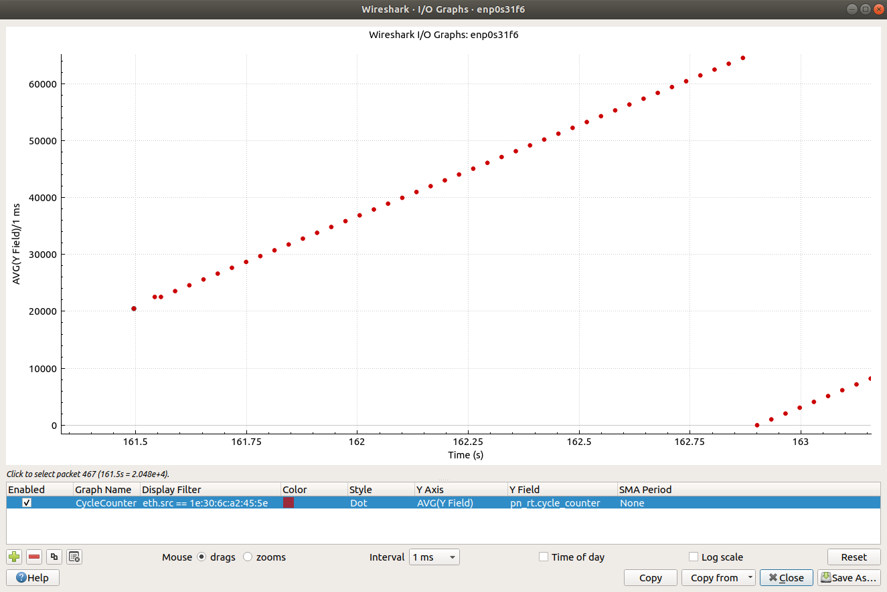
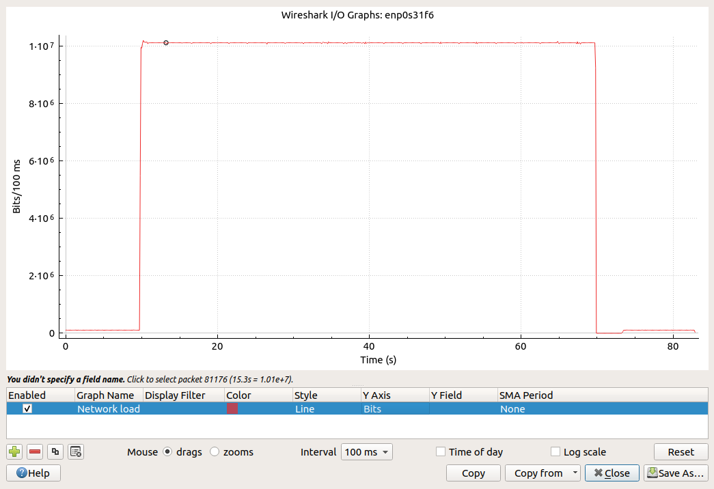

Capturing and analyzing Ethernet packets
========================================
In order to understand the Profinet traffic, it is useful to capture network
packets and analyze them in a tool like Wireshark. You typically run
Wireshark on your laptop, but in order to capture packets on for example
a Raspberry Pi you can use the program tcpdump (described below).

Install Wireshark on Linux
--------------------------
To install a relatively new Wireshark version on Ubuntu::

    sudo add-apt-repository ppa:wireshark-dev/stable
    sudo apt update
    sudo apt -y install wireshark

In order to be able to capture packets you need to add yourself to the
``wireshark`` user group, or run the program as root::

    sudo wireshark

For details on how to add yourself to the ``wireshark`` user group, see
https://linuxhint.com/install_wireshark_ubuntu/

Wireshark is also available on Windows. Download it from https://www.wireshark.org/

Install Wireshark on Windows
----------------------------
Download Wireshark from https://www.wireshark.org/download.html

Filtering frames in Wireshark based on protocol
-----------------------------------------------
To show only frames with specific protocols, enter this into the "display
filter" text box::

   lldp or snmp or pn_dcp or dcerpc or pn_io or syslog

To hide frames with specific protocols::

   not (pn_ptcp or arp or mdns or llmnr or ssdp or dhcp or dhcpv6 or icmpv6 or igmp or nbns or browser or ipv6)

+--------------------------+----------------------------------------------------+
| Filter expression        | Wireshark protocol names                           |
+==========================+====================================================+
| arp                      | ARP                                                |
+--------------------------+----------------------------------------------------+
| epm                      | EPM                                                |
+--------------------------+----------------------------------------------------+
| lldp                     | LLDP                                               |
+--------------------------+----------------------------------------------------+
| pn_dcp                   | PN-DCP                                             |
+--------------------------+----------------------------------------------------+
| pn_io                    | PNIO and PNIO_PS and PNIO-AL                       |
+--------------------------+----------------------------------------------------+
| pn_io_controller         | PNIO-CM (application ready)                        |
+--------------------------+----------------------------------------------------+
| pn_io_device             | PNIO-CM (connect, read, read implicit, write,      |
|                          | param end, release)                                |
+--------------------------+----------------------------------------------------+
| dcerpc                   | PNIO-CM and EPM                                    |
+--------------------------+----------------------------------------------------+
| pn_ptcp                  | PN-PTCP                                            |
+--------------------------+----------------------------------------------------+
| snmp                     | SNMP                                               |
+--------------------------+----------------------------------------------------+
| syslog                   | Syslog                                             |
+--------------------------+----------------------------------------------------+

Filter frames in Wireshark based on frame contents
--------------------------------------------------
To show Profinet read and write commands for a specific index::

   pn_io.index == 0x8071

To show Profinet read and write commands for a specific subslot::

   pn_io.subslot_nr == 0x8001

To look for a specific OID in SNMP messages::

   snmp.name == 1.3.6.1.2.1.1.3.0

Select frames with a specific DCE RPC Activity UUID::

   dcerpc.dg_act_id == 38353218-0002-1010-ae64-ac6417366047

Coloring rules in Wireshark
---------------------------
To modify the coloring rules in Wireshark, use the menu View > "Coloring rules".
Deselect the rules you don't need.

Create a new rule by clicking the ``+`` symbol in the lower left corner.
Enter the filter expression and the name of the new rule. Enable it using the
checkbox. With the rule still marked, click the "Background" button to modify
the background color.

+------------+----------------------------------------------------------+
| Rule name  | Filter                                                   |
+============+==========================================================+
| LLDP       | lldp                                                     |
+------------+----------------------------------------------------------+
| SNMP       | snmp                                                     |
+------------+----------------------------------------------------------+
| Syslog     | syslog                                                   |
+------------+----------------------------------------------------------+
| DCP        | pn_dcp                                                   |
+------------+----------------------------------------------------------+
| DCERPC     | dcerpc                                                   |
+------------+----------------------------------------------------------+
| PNIO ALARM | ``pn_rt.frame_id == 0xfc01 || pn_rt.frame_id == 0xfe01`` |
+------------+----------------------------------------------------------+
| PNIO       | pn_io                                                    |
+------------+----------------------------------------------------------+

Move the most specific lines to the top.

Parsing Profinet cyclic data with Wireshark
-------------------------------------------
It is possible to load a GSDML file into recent versions of Wireshark, for
parsing the cyclic data.
In the Wireshark menu, select Edit > Preferences > Protocols > PNIO.
Enter the directory where you have your GSDML file.

For this functionality to work, the Wireshark capture must include the start-up
sequence. When a packet is interpreted according to a GSDML file, the name of
the GSDML file is displayed in the detail view of the packet.

Diagnosis data in Wireshark
---------------------------
Note that Wireshark can not yet decode QualifiedChannelDiagnosisData.
See the ``dissect_AlarmUserStructure ()`` function in
the ``packet-dcerpc-pn-io.c`` file in the source code for Wireshark.

Show wall time in Wireshark
---------------------------
In order to correlate captured Wireshark frames to other logs, it can be
convenient to display wall time in the time column in Wireshark.
Right-click the column header, and select "Edit Column".
For "Type" use "Time (format as specified)". Click OK.
In the main menu View > "Time Format Display" select "Time of day".

Show transmission time periodicity using Wireshark
--------------------------------------------------
In order to study the periodicity of sent frames, in the filter heading on the
main screen select the MAC address of the p-net IO-device, for example::

    eth.src == 54:ee:75:ff:95:a6 and pn_io

In the column header, right-click and select "Column Preferences ...". Press "+"
to add a new column. Change "Title" to "Delta displayed" and "Type" to
"Delta time displayed".

Plot transmission time periodicity using Wireshark
--------------------------------------------------
To plot the periodicity of sent frames, you first need to filter the displayed
frames in the main Wireshark window, as described above.

Then use the menu "Statistics" -> "I/O Graph".

* Display filter: ``eth.src == 54:ee:75:ff:95:a6 and pn_io``
* Y Axis: AVG(Y Field)
* Y Field: ``frame.time_delta_displayed``
* SMA (sample moving average) Period: None
* Interval: 10 or 100 ms.

Adapt the MAC address to your p-net IO-device.
You need to zoom the Y-axis to an interesting range, maybe 0-10 ms.

It is also interesting to add a line "MAX(Y Field)" and a line "MIN(Y Field)"
in the same graph as the first line. See below for an example where the
average frame interval is 1 ms.

The lines should be interpreted as the average, minimum and maximum
packet-to-packet times during the interval (for example 100 ms).

Plot Profinet cycle counter
---------------------------
The cycle counter should increase between each frame. You can use Wireshark to verify that.

Use the menu “Statistics” -> “I/O Graph”.

* Display filter: ``eth.src == 54:ee:75:ff:95:a6``
* Style: Dot
* Y Axis: AVG(Y Field)
* Y Field: ``pn_rt.cycle_counter``
* SMA (sample moving average) Period: None
* Interval: 1 ms

Adapt the MAC address to your p-net IO-device.

Zoom to the relevant time period, and y-axis range of approx 0 to 70000.
The frame cycle counter increases up to max 65535 before it wraps to 0.
It is important that the samples are evenly distributed in time (on the
horizontal axis). See the image below (captured during a trouble-shooting
session).

Plot network load
-----------------
Use the menu “Statistics” -> “I/O Graph”.

* Display filter: (none)
* Style: Line
* Y Axis: Bits
* Y Field: (none)
* SMA (sample moving average) Period: None
* Interval: 100 ms or 1 s

See below for an example captured during a "Security Level 1" network load test,
where the network load is close to 100 Mbit/s (1E8 bits/s).

tcpdump
-------
When running on an embedded Linux board, it can be convenient to run without
a graphical user interface. To capture packets for later display in Wireshark,
use the tool ``tcpdump``.

Install it, for example like::

    sudo apt-get install tcpdump

Run it with::

    sudo tcpdump -i enp0s31f6 -n -w outputfile.pcap

Use the ``-i`` argument to specify Ethernet interface.

Transfer the resulting file to your laptop, where you can open it in Wireshark.

Note that Wireshark and tcpdump modifies the network interface settings on Linux.
The promiscuous bit will be enabled, as seen when looking at
``/sys/class/net/eth0/flags``. It will not be visible via ``ifconfig`` though.

Hardware for capturing packets on network
-----------------------------------------
Profinet is a point-to-point protocol. If the Profinet controller or device
software is running on your machine, you can use Wireshark (or tcpdump)
directly to capture the packets.

If you would like to capture packets between other units (Profinet
controllers/devices) you need special hardware to do the capturing. A network
tap is a network switch with packet monitoring to send a copy of each packet
to another Ethernet connector. Connect the tap on the network link between the
IO-device and IO-controller. Connect the mirroring port to the machine where
you run Wireshark or tcpdump.
