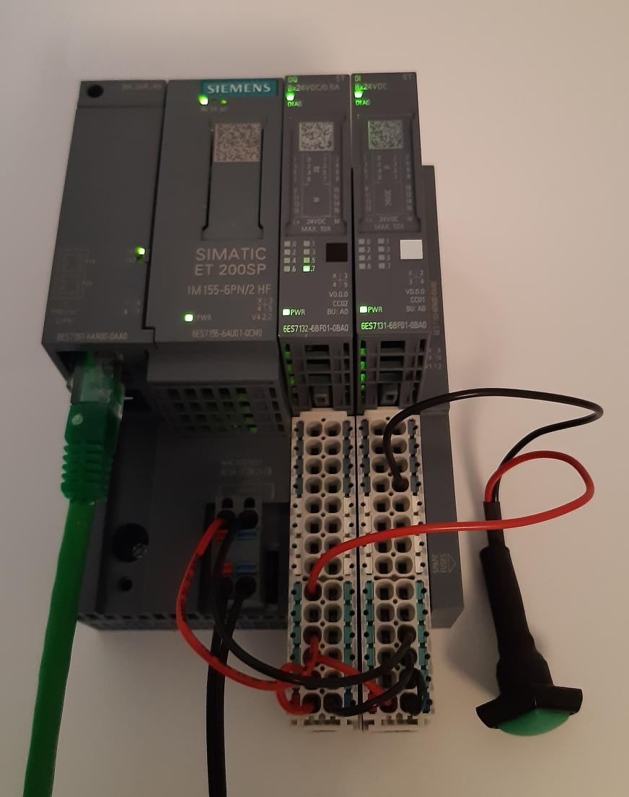

Compliance testing of IO-devices
================================
All Profinet products need to be certified. That is done after testing by an
accredited PROFIBUS & PROFINET International test lab (PITL).
The full hardware, communication stack and application software is tested
together. This is also known as certification testing or conformance testing.

Each manufacturer of Profinet equipment needs a Vendor ID, which is obtained
from the PI Certification Office.

The tests checks the GSD file, the hardware interface and the Profinet
behavior. The tests should be performed on a device from series production.

The Profinet equipment also needs to fulfill parts of the IEEE802 standards,
for example uniqueness of MAC addresses. This is not tested by the test lab.

A detailed description of the certification process can be downloaded from
https://www.profibus.com/download/how-to-get-a-certificate-for-a-profinet-device/

See also the general requirements on the page "Creating applications and
porting to new hardware" in this documentation.

Needed for certification:

* EMC test report
* European Union declaration of conformity (for CE marking)
* The user manual must be available.
* A valid GSD file

Tool for pretesting
--------------------
For Profinet members, the "Automated RT tester" tool is available for download.
It is useful for pretesting before a full compliance test.

Profinet devices must fulfill "Security Level 1" with regards to the net
load. This is tested by a separate tool (not the "Automated RT tester").

Installation of Automated RT tester on a Windows PC
---------------------------------------------------
Unzip the downloaded file, and double-click the
"AutomatedRtTester_VERSION_Setup.exe" file.

Verify that you use the latest available version.

Adjust the Ethernet network card on a Windows PC
------------------------------------------------
To use the "Automated RT tester" tool you need to adjust the Ethernet interface
settings of your PC. In the properties for the driver, go to the "Advanced"
tab. For the "Packet priority & VLAN" select "Packet priority & VLAN Disable".
More details are given in the "Product Documentation" document for the tool.

You also need to turn off LLDP protocol for the selected network interface
on the laptop running the "Automated RT tester" tool,
otherwise the test case “Different access ways port-to-port” will fail.
Both Windows and Simatic TIA ("PROFINET IO Protocol (DCP/LLDP)") can have
LLDP implemented.

Adjust the settings of the Ethernet card of your personal computer to use
100 Mbit/s full duplex (otherwise the test case "Different access ways
port-to-port" will fail).

Set the IP address to ``192.168.0.25`` and netmask to ``255.255.255.0``.

Use a separate network for running tests with Advanced RT tester
(avoid running it on a network with unrelated devices).

Supported GSD versions
----------------------
The "Automated RT tester" tool is compatible only with a few versions of GSDML
files. See the document "PN_Versions_for_certifications" included in the
download.

Create a project
----------------
Use the menu File > New > “Device Test Project”. Follow the wizard.
Enter the MAC address of the IO-Device. If you use the Profinet switch
(device "B") you can press the button "Get MAC Address", as the ART-tester
queries the network for the alias ``port-003.b``.

On the “Profinet settings” page, select the GSDML file for the IO-Device.

Populate modules/submodules in slots/subslots by
marking a module in the left column, and then click the -> arrow. To insert a
submodule, mark the relevant submodule in the left column and mark the
appropriate slot in the right column.

To remove from a slot or subslot, mark it (in the right column) and press the
<- arrow.

Adjust settings
---------------
You need to adjust the device MAC address. This is done via the menu
Tools > Options > DUT. Enter the value and press OK.

If the device does not have support for remote change of values, you might
need to adjust the device station name, IP address and subnet mask.
This is done via the menu Tools > Options > Setting. You might need to
click the "Show expert settings".

Run tests
---------
Select the tests (in the left side menu) to run. Failing tests are time
consuming, so start with a single test to verify the communication. Disable all
tests by the left side menu. Press the "Deselect all" icon. Then open "Automated
test cases" > "Standard Setup" > DCP, and enable "DCP - DCP_IDN". Use the menu
Project > Run.

When communication is verified, enable all relevant test cases.

The ART tester tool stores Wireshark files (.pcap files) in the
project directory. See the ``EthernetDump`` subdirectory.

To export test reports as PDF, click the small printer icon in the top
toolbar.

Checklist before starting ART Tester tests. Use correct:

   * Cabling
   * Software version and compile time options
   * Ethernet interface settings for ART Tester laptop
   * GSDML file
   * Plugged modules in ART Tester
   * Make sure no other device uses the IP address ``192.168.0.50``

Additional hardware
-------------------
Some of the test cases requires additional hardware; a Profinet-enabled switch
("Device B") and an IO-controller ("Device A"). Also a remote controlled
power outlet can be used to simplify the tests.

+-------------------------+-----------------------------+------------------------+
| Item                    | IP address                  | Description            |
+=========================+=============================+========================+
| Device under test (DUT) | 192.168.0.50                |                        |
+-------------------------+-----------------------------+------------------------+
| ART tester on PC        | 192.168.0.25, 192.168.1.143 |                        |
+-------------------------+-----------------------------+------------------------+
| PLC ("Device A")        | 192.168.0.100               |                        |
+-------------------------+-----------------------------+------------------------+
| Switch (“Device B”)     | 192.168.0.99                |                        |
+-------------------------+-----------------------------+------------------------+
| Neighbour (“Device D”)  | 192.168.0.98                | To port 2 of DUT       |
+-------------------------+-----------------------------+------------------------+
| Neighbour (“Device E”)  | 192.168.0.97                | To highest port of DUT |
+-------------------------+-----------------------------+------------------------+
| Power outlet            | 192.168.1.244               | Separate network       |
+-------------------------+-----------------------------+------------------------+

Profinet-enabled switch
^^^^^^^^^^^^^^^^^^^^^^^^^^^^^^
Some of the test cases for the Automated RT Tester requires an Profinet-enabled
switch. It is called "Device B" in the test setup documentation.

The test specification of version V 2.41 recommends the use of a
Siemens Scalance X204IRT (article number 6GK5204-0BA00-2BA3).
The ART Tester is rather strict regarding the model of Siemens Profinet switch.
It should have IP address ``192.168.0.99``, netmask ``255.255.255.0`` and station name "b".
Use for example Codesys to scan for the device, and to adjust the IP settings.
Alternatively, use SinecPni to change the IP address (see the Simatic
page in this documentation).

The switch has a web interface, but it is not necessary to do any setting
adjustments via the web interface.
Log in to the web interface by directing your web browser to its IP address.
User name "admin", factory default password "admin".

Connection of the switch ports is described in the table below:

+-------------+-----------------------------------------------+
| Switch port | Connected to                                  |
+=============+===============================================+
| P1          | Personal computer running Automated RT Tester |
+-------------+-----------------------------------------------+
| P2          | IO-controller ("Device A" port X1 P1)         |
+-------------+-----------------------------------------------+
| P3          | Device under test (DUT) running p-net         |
+-------------+-----------------------------------------------+

The Automated RT tester will detect "Device B" by itself. No configuration is
required in the Automated RT tester menu.

The setting "Use IEC V2.2 LLDP mode" available via the STEP7 Profinet setup
tool controls the format of the sent portID in LLDP frames.
With the "Use IEC V2.2 LLDP mode" enabled the portID is sent as ``port-001``,
while it is sent as ``port-001.b`` if disabled. The latter format is used in
Profinet 2.3 and newer. The ART tester requires the LLDP format to be in the
2.2 format, otherwise it will complain about portID length.
One way to restore the behavior to the 2.2 format is to do a factory reset
of the switch via the web interface or by pressing the SET button for more than
20 seconds (if the button not is disabled in the web interface).

Remote controlled power outlet
^^^^^^^^^^^^^^^^^^^^^^^^^^^^^^
The Automated RT Tester can control an "Anel Net-PwrCtrl" power outlet via Ethernet.
It must be connected via a separate Ethernet
interface on the personal computer. Use a static IP address ``192.168.1.243`` with
subnet mask to ``255.255.255.0`` on that interface.

The Power outlet has a default IP address of ``192.168.0.244``, and it has a
built-in web server. Enter its IP address in your web browser to log in
(username and password printed on the hardware).
(You might need to temporary set your Ethernet interface to IP ``192.168.0.1``
and subnet mask to ``255.255.255.0``)
Modify the IP settings (on the "Einstellung" page) to use a static IP address
of ``192.168.1.244``.
On the "Steuerung" page you can control the individual power outputs.

Connect power for your device under test to connector number 3 on the power outlet.

Test the functionality from Automated RT Tester by clicking on the symbol to the
left of the "PowerOutlet" text in the tool bar. The symbol to the right of the
"PowerOutlet" text shows a green check mark when the outputs are on, and a
black cross when the outputs are off (or when the power outlet not is connected).

+--------------+------------------------------------------------------------+
| Power outlet | Connected to                                               |
+==============+============================================================+
| 1            | PLC "A"                                                    |
+--------------+------------------------------------------------------------+
| 2            | Profinet enabled switch "B"                                |
+--------------+------------------------------------------------------------+
| 3            | Device under test (DUT) running p-net                      |
+--------------+------------------------------------------------------------+
| 4            | Neighbour device "D", connected to DUT port 2              |
+--------------+------------------------------------------------------------+
| 5            | Neighbour device "E", connected to DUT highest port number |
+--------------+------------------------------------------------------------+

Hardware naming
^^^^^^^^^^^^^^^
Different types of Siemens hardware are used for the conformance test.
In order to simplify how the different units should be connected together,
a list of Siemens naming conventions is provided here:

* AI: Analog input module
* AQ: Analog output module
* BA: Basic
* BA: Busadapter (with RJ45 or fiber optic connectors)
* BU: BaseUnit (for mounting input and output modules)
* CM: Communication module
* CU: Ethernet connector (copper wires)
* DI: Digital input module
* DP: Profibus DP
* DQ: Digital output module
* F-: Fail safe
* FC: Fast Connect (A bus adapter for network cables)
* HF: High feature
* HS: High speed
* IM: Interface Module
* L+: +24 V DC
* M: Ground connection
* MLFB: Article number (order number) Maschinen Lesbare Fabrikate Bezeichnung
* MP: ?
* P: Port
* PN: Profinet
* R: Ring port for media redundancy
* SM: Special module
* SP: Scalable Peripherals
* ST: Standard
* TM: Technology module
* X: Interface

Siemens IO-device for verification of multi-port devices
^^^^^^^^^^^^^^^^^^^^^^^^^^^^^^^^^^^^^^^^^^^^^^^^^^^^^^^^
It is called "Device D" in the test setup documentation.

+--------------------------------------+-------------------------------------------+
| Part                                 | Comments                                  |
+======================================+===========================================+
| Interface module ET200 IM155-6PN/2HF |                                           |
+--------------------------------------+-------------------------------------------+
| Digital output module DQ 132         | In slot 1 (closest to interface module)   |
+--------------------------------------+-------------------------------------------+
| Digital input module DI 131          | In slot 2                                 |
+--------------------------------------+-------------------------------------------+
| Base uint A0 (24 VDC, light colored) | One for each input/output module          |
+--------------------------------------+-------------------------------------------+
| Bus adapter                          | With two RJ45 connectors                  |
+--------------------------------------+-------------------------------------------+
| Server module                        | Delivered with the interface module. Put  |
|                                      | it in slot 3.                             |
+--------------------------------------+-------------------------------------------+

See the Profinet test specification for part numbers.

Light-colored bus adapters are used for supply voltage distribution.
The cyan-colored (auxiliary) terminals on bus-adapters are all connected together.
If you only use light-colored bus adapters, then the cyan-colored terminals on
one bus adapter are isolated from the corresponding terminals on other bus adapters.

Connect +24 V to the red terminals of the interface module and the base units.
Connect 0 V to the blue terminals of the interface module and the base units.

Connect a button via wires to the digital input (DI) module. Connect it between
DI.7 (pin 18) and and +24 V. The LED ".7" on the input module will be green
when the button is pressed.

The LED ".7" on the digital output module (DQ) will be green when the output
is high (+24 V).

Use the Ethernet connector P1R.

See the page on setting up a Simatic PLC in this documentation for
instructions on usage.

Make sure that the LLDP frames are in the legacy LLDP format, where the PortId
is "port-001" instead of "port-001.d". This is done via the setting
"Use IEC V2.2 LLDP mode", available in the STEP7 Profinet setup tool for PLCs.

Set up Cisco SF352-08P switch
^^^^^^^^^^^^^^^^^^^^^^^^^^^^^
For multiport Profinet devices, also SNMP-communication to non-Profinet
devices is verified. This Cisco switch can be used for that purpose.
Replaces "Device D" in the test setup.

The system LED flashes during startup, and lights steady when the switch is
properly set up and running.
Note that the boot time can be around 100 seconds.

Connect an Ethernet cable to port G1.
Set your laptop IP address to ``192.168.1.143`` and netmask to be ``255.255.255.0``.
Log in to ``192.168.1.254``. Default username is ``cisco`` and password is ``cisco``.
Change password when prompted.

Set the IP address via the left side menu "IP configuration" -> "IPv4 Management and Interfaces" -> "IPv4 Interface".
Click "Add" and enter the static IP address ``192.168.0.98``. Use netmask ``255.255.255.0``.
The switch will change IP address to a new subnet, so you might need to change your
laptop network setting before connecting to the new IP address.

Adjust LLDP settings via menu Administration -> "Discovery - LLDP" -> Properties.
In the page top bar, set "Display mode" to Advanced. Set "Chassis ID Advertisement"
to "MAC Address".

Via Administration -> "Discovery - LLDP" -> "Port settings" select port FE1 and
click Edit. Enable SNMP notification. Select the optional TLVs that start with "802.3".

Via the menu Security -> "TCP/UDP Services", enable "SNMP Service".

In the page top bar, set "Display mode" to Advanced.
Add a SNMP community via the left side menu SNMP -> Communities and
click Add. The community string should be "public". Set "SNMP Management
Station" to "All". Click "Apply" and "Close".

In the top of the page click the "Save" icon.

For the actual measurements, use the port 1 on the Cisco switch.

Verify the SNMP communication to the Cisco switch::

   snmpwalk -v1 -c public 192.168.0.98

Tips and ideas
--------------
If you end up with ``Pass with Hint "The device made a EPM Request from a
not Profinet port"``, that means that wrong source port was used when sending
UDP messages. See the page on Linux in this documentation on how to adjust the
ephemeral port range.

If your software version indicates that it is a prototype version (letter "P")
the Automated RT Tester will mark this as pass with hint.

The Automated RT Tester has a convenient feature for remotely setting the
station name, IP address, netmask and gateway of the device under test (DUT).
Use the menu Tools > "Set DUT name and IP".
It will change the settings of the IO device via DCP communication. It is also
possible to do a factory reset of the IO device.

It can be useful to show the ART tester log messages in the target output.
On your Linux target run (replace interface name if necessary)::

   tcpdump -i br0 udp port 514 -v -a

Reduce timeout values to speed up testing
-----------------------------------------
It is possible to reduce the timeout values used by Automated RT Tester. This
can be convenient during development, in order to speed up the tests.
Use the menu Tools > Options, and enable "Show expert settings". The time
settings are found on the "Expert Settings" tab.
The times are given in milliseconds.
Remember to use the default values when doing pre-certification testing.

These values have large impact on test execution times:

* ApplicationReadyReqTimeout
* ConnectResTimeout
* DcpResetToFactoryTestSetupTime
* DutBootUpTime
* ReleaseArResTimeout
* StandardTestSetupBootTime
* WriteResTimeout

Relevant test cases for conformance class A
-------------------------------------------

+-------------------------------------------------+-----------------------------------------------------------------+
| Test case                                       | Notes                                                           |
+=================================================+=================================================================+
| DCP_1                                           | Power cycle 8 times.                                            |
+-------------------------------------------------+-----------------------------------------------------------------+
| DCP_2                                           | Power cycle 2 times.                                            |
+-------------------------------------------------+-----------------------------------------------------------------+
| DCP_3                                           | Power cycle 2 times.                                            |
+-------------------------------------------------+-----------------------------------------------------------------+
| DCP_4                                           | Fast                                                            |
+-------------------------------------------------+-----------------------------------------------------------------+
| DCP_ALIAS                                       | Requires additional hardware ("Device B")                       |
+-------------------------------------------------+-----------------------------------------------------------------+
| DCP_IDN                                         | Fast.                                                           |
+-------------------------------------------------+-----------------------------------------------------------------+
| DCP_NAME_1                                      | Power cycle 4 times.                                            |
+-------------------------------------------------+-----------------------------------------------------------------+
| DCP_NAME_2                                      | Power cycle 4 times.                                            |
+-------------------------------------------------+-----------------------------------------------------------------+
| DCP_ResetToFactory                              |                                                                 |
+-------------------------------------------------+-----------------------------------------------------------------+
| DCP_OPTIONS_SUBOPTIONS                          |                                                                 |
+-------------------------------------------------+-----------------------------------------------------------------+
| DCP_Router                                      |                                                                 |
+-------------------------------------------------+-----------------------------------------------------------------+
| DCP_Access                                      | Fast.                                                           |
+-------------------------------------------------+-----------------------------------------------------------------+
| DCP_VLAN                                        | Power cycle 2 times                                             |
+-------------------------------------------------+-----------------------------------------------------------------+
| DCP IP-parameter Remanence                      | Power cycle 4 times.                                            |
+-------------------------------------------------+-----------------------------------------------------------------+
| Behavior Scenario 1 to 9                        | Power cycle                                                     |
+-------------------------------------------------+-----------------------------------------------------------------+
| Behavior Scenario 10                            | Power cycle 7 times.                                            |
+-------------------------------------------------+-----------------------------------------------------------------+
| Behavior Scenario 11                            |                                                                 |
+-------------------------------------------------+-----------------------------------------------------------------+
| Different Access Ways                           | Requires additional hardware ("Device B")                       |
+-------------------------------------------------+-----------------------------------------------------------------+
| PDEV_CHECK_ONEPORT                              | Requires additional hardware ("Device B"). Power cycle 3 times. |
+-------------------------------------------------+-----------------------------------------------------------------+
| Diagnosis                                       | Requires additional hardware ("Device B"). Power cycle twice.   |
+-------------------------------------------------+-----------------------------------------------------------------+
| Alarm                                           | Requires additional hardware ("Device B")                       |
+-------------------------------------------------+-----------------------------------------------------------------+
| AR-ASE                                          | Power cycle                                                     |
+-------------------------------------------------+-----------------------------------------------------------------+
| IP_UDP_RPC_I&M_EPM                              | Power cycle                                                     |
+-------------------------------------------------+-----------------------------------------------------------------+
| RTC                                             | Requires additional hardware ("Device B")                       |
+-------------------------------------------------+-----------------------------------------------------------------+
| VLAN                                            | Fast. Use port-to-port set up.                                  |
+-------------------------------------------------+-----------------------------------------------------------------+
| Different access ways port-to-port              | Use port-to-port set up                                         |
+-------------------------------------------------+-----------------------------------------------------------------+
| Manual: DCP_Signal                              | Flash Signal LED. Fast.                                         |
+-------------------------------------------------+-----------------------------------------------------------------+
| Manual: Behavior of ResetToFactory              | Power cycle 4 times.                                            |
+-------------------------------------------------+-----------------------------------------------------------------+
| Manual: Checking of sending RTC frames          | Fast                                                            |
+-------------------------------------------------+-----------------------------------------------------------------+
| Not automated: DataHoldTimer                    | PLC required. Use network tap at DUT.                           |
+-------------------------------------------------+-----------------------------------------------------------------+
| Not automated: Interoperability                 | PLC required                                                    |
+-------------------------------------------------+-----------------------------------------------------------------+
| Not automated: Interoperability with controller | PLC required                                                    |
+-------------------------------------------------+-----------------------------------------------------------------+
| Security Level 1                                | PLC required                                                    |
+-------------------------------------------------+-----------------------------------------------------------------+

Relevant test cases for conformance class B
-------------------------------------------
Set the GSDML file attributes ``ConformanceClass="B"`` and
``SupportedProtocols="SNMP;LLDP"``.

* Behavior scenario 10
* Topology discovery check, standard setup. Requires additional hardware (“Device B”).
* Topology discovery check, non-Profinet-neighbour setup
* Port-to-port
* Behavior of reset to factory (manual)

Additional test cases for multi-port devices
--------------------------------------------
Requires additional hardware ("Device B", “Device D” and Cisco switch).

* PDEV_RECORDS
* Topology discovery check, standard setup.
* Topology discovery check, non-Profinet setup. Uses Cisco switch. Power cycle twice.

For "port-to-port" testing on devices with multiple ports, connect the port
directly to the ART tester laptop. Leave other ports on the device not
connected.

Relevant test cases for legacy startup mode
-------------------------------------------
Legacy startup mode is defined in Profinet version 2.2 and earlier.
Set the attribute ``StartupMode`` in the GSDML file to ``"Legacy;Advanced"``.
Also the attributes ``PNIO_Version`` and ``NumberOfAR`` affects the ART tester
behavior.

* SM_Legacy
* Different Access Ways
* Different Access Ways port-to-port
* DCP
* AR-ASE
* IP_UDP_RPC_I&M_EPM
* Behavior
* FSU (if also supporting fast startup)
* Interoperability (use a legacy PLC)
* Interoperability with controller (use a legacy PLC)

Relevant test cases for fast startup (FSU)
------------------------------------------
Set the parameters ``ParameterizationSpeedupSupported="true"`` and
``DCP_HelloSupported="true"``. The attribute ``PowerOnToCommReady="700"``
describes the startup time in milliseconds.

* FSU
* Different Access Ways
* Manual FSU test case
* Hardware (no auto-negotiation)

Relevant test cases for DHCP
----------------------------
In the GSDML file, set the ``AddressAssignment`` attribute to ``"DCP;DHCP"``.

* DHCP

Relevant test cases for MRP
---------------------------
In the GSDML file, adjust the ``MediaRedundancy`` and ``SupportedRole``
attributes.

* MRP_1
* MRP_2
* MRP_chk1
* MRP_chk2
* MRP_OFF1
* MRP_OFF2
* MRP_On1
* MRP_On2

These are named "MRP_Pdev", and are described in
"TCS_00004126_MRP_Pdev_ctrl_not_automated_V2.42.1.pdf".

The PLC (CPU 1516-3 PN/DP) and the neighbour device (Interface module IM
155-6PN/2) used in the standard setup both have support for MRP.

Other tests
-----------
Your GSDML file should pass the verification with the "GSDMLcheck" tool.

Details on tests with PLC
-------------------------

Load PLC program
^^^^^^^^^^^^^^^^
Verify that the sample application PLC program is working properly with your
IO-device. Button1 should be able to control the state of data LED (LED1).

Interoperability
^^^^^^^^^^^^^^^^
Run with PLC for 10 minutes without errors.
If the device under test has more than one port, there should be 5 IO-devices
connected to the non-PLC port.

For the cyclic data, use one input module and one output module.
The PLC should be programmed to continuously read out record data.

The timing should be the fastest allowed according to the GSDML
file, and use 3 "accepted update cycles without IO data".
Record startup and data exchange using Wireshark.

In the Wireshark file, make sure IOPS and IOCS in the cyclic data from the
IO-device have the value GOOD after it has sent the "application ready"
message.
Also verify that there have been no alarms (sort the frames by protocol).

* "Record data"?
* ExpectedIdentification is equal to the RealIdentification?
* How to create additional net load? (using DCP Identify all)
* Implicit read?

Data Hold Timer
^^^^^^^^^^^^^^^
Run with PLC. The timing should be the fastest allowed according to the GSDML
file, and use 3 "accepted update cycles without IO data".
Record startup and data exchange using Wireshark.

Unplug network cable from the PLC.

In the Wireshark file:

* Count the number of cyclic data frames sent by the IO-device before the
  alarm frame appears. It is allowed that 3-6 data frames are sent before
  the alarm frame.
* At startup the first valid data frame should be sent within the data
  hold time.
* The IOCS in the cyclic data from the IO-device should have the value GOOD
  after the "application ready" message has been sent.
* Verify the data cycle time.

Repeat the cable unplugging measurements with reduction ratios (1), 2, 4, 8
and 16. With a cycle time of for example 1 ms this corresponds to a frame
send interval of 1 ms to 16 ms, and a data hold time of 3 ms to 48 ms.

Check that a LLDP frame is sent within 5 seconds, and then every 5 seconds.
The TTL value in the LLDP frame should be 20 seconds.
The MAUtype, "autonegotiation supported" and "autonegotiation enabled" must
be correct.

Interoperability with controller
^^^^^^^^^^^^^^^^^^^^^^^^^^^^^^^^
Run with PLC. The timing should be the fastest allowed according to the GSDML
file, and use 3 "accepted update cycles without IO data".
Record startup and data exchange using Wireshark.

Verify that the outputs are according to the manual of your IO-device when
you do these actions (repeat several times):

* PLC powered off
* PLC powered on. The program should be running.
* Switch the PLC to stop.
* Switch the PLC to run.
* Disconnect cable from PLC.
* Reconnect the PLC cable.

In the Wireshark file, make sure IOPS and IOCS in the cyclic data from the
IO-device have the value GOOD after it has sent the "application ready"
message.

* Record data?

Security Level 1 tester
-----------------------
A PLC program is used to both establish cyclic data communication, and to
continuously read out parameter values from the IO-device under test (DUT).
If the DUT has more than one port, a neighbour device "D" is connected to
port 2, and the PLC will control the digital inputs and outputs of device D.

A program running on a Linux laptop will generate additional network load.
Depending on the result, the DUT will be assigned net load class 1 to 3.

See also the guideline "PROFINET IO Security Level 1".

It can be useful to run the other PLC-based tests before, to find out the
shortest cycle time useful when there is no additional network load.

PLC program
^^^^^^^^^^^
Use the STEP7 project from the test bundle, and import it into the TIA portal.
In Siemens TIA Portal, open the file "normal_d_V2.40.0_V15.1.zap15_1" as
an existing project. Give the path to a local directory that will be used
for the project.

The block "Main [OB0]" will call the "FC001_Test_Programm", and it will also
read and set the digital inputs and outputs on neighbour device D.

Data block "DB003_RECORD_Index" contains an array of record numbers (parameters)
that are to be read from the IO-device. It also contains a counter value
keeping track of which entry in the array that is being used right now.
The block "Startup" will initialize this counter value.

The "FC001_Test_Programm" function will call "FB001_RDREC", and then
will the counter value be increased.

The "FB001_RDREC" function block will read out a parameter from the IO-device
and store any error value. It should be maximum 100 ms from one response
until the next request is sent out by the PLC.

Data block "DB002_RECORD_data" has a large array of bytes for storing the
record data read from the IO-device.

Device D should have a digital input module and a digital output module. It
should have a cycle time of 1 ms and an IP address ``192.168.0.98``.
If the device "D" is not exactly the variant you have, you need to replace it
with another IO-device with digital inputs and outputs. Default connection:

* Input ``%I0.0`` Ix_Req  (Enables continuous readout of parameter values)
* Input ``%I0.1`` Ix_ACK  (Acknowledges errors)
* Output ``%Q0.0`` Qx_Error
* Output ``%Q0.1`` Qx_Error_RDREC

Delete the existing "dut" device.
Import the GSDML file of your device (the DUT), and insert your device.
Plug relevant modules into the slots.
Give it the station name ``dut``, and it should use the IP address
``192.168.0.50``. Connect it to the PLC via the "Network view".

In the "Device view" select the DUT, and in the "Device overview" select the
DUT line. In Properties > "System constants" find the hardware identifier
number for the line "dut~HEAD".

Adjust cyclic time setting of the DUT.

In the "Main [OB1]" block make sure that the hardware identifier is set to
the relevant value::

    Ihw_ID := "dut~HEAD",

or to the value found above (for example)::

    Ihw_ID := 261,

Create a watch table for the relevant entries.

Compile the hardware configuration and the software, and download to the PLC.

If the DUT only has one port the neighbour device "D" is not needed.
Normally one of the digital inputs of device "D" is enabling the continuous
reading out of parameter values, but you need instead to force the corresponding
PLC program variable to a high level. In the left side menu use "Watch and
force tables" (below the PLC), and add a new entry by clicking an empty row
in the "Name" column, and select "Ix_Req". When later in online mode, click
the small "Show/hide all modify columns" to show the column. Enter "TRUE" in
the "Modify value" on the line for "Ix_Req". Select that line by enabling
the corresponding check box. Press the "Modify all selected values once
and now".

Tester software for additional network load
^^^^^^^^^^^^^^^^^^^^^^^^^^^^^^^^^^^^^^^^^^^
Install the tester software on an Ubuntu machine, or in a virtual Ubuntu
machine running on Windows. The IP address should be ``192.168.0.30``.
See the PDF in the "Security Level 1"/"tester" folder in the downloaded
test bundle. The program ends up in ``/root/Netload``. See the PDF
how to start the program.

The SL1-tester has a number of template ``.pcap`` files, and rewrites those
files with the MAC address of the SL1-tester laptop and the DUT.
Rewriting is done using the Bittwist editor tool (``bittwiste``).
The MAC of the DUT is found with the ``arping`` Linux command.
Actual sending of frames is done with the ``packETHcli`` Linux command.

Set up hardware
^^^^^^^^^^^^^^^
Set the station name of the DUT to ``dut`` and the IP address to ``192.168.0.50``.
Use a temporary station name, to be able to detect device reboots.

Set the station name of device D to ``d`` and the IP address to ``192.168.0.98``.

The digital input "Ix_Req" is used to enable continuous read out of parameter
values. Set it to high level to start the readout.
Verify that there is cyclic communication, and that there is repeated
acyclic data read out.

Use a non-Profinet switch (no LLDP packet filtering) to connect the device
under test (DUT, port 1), the PLC and the personal computer running the Security
Level 1 tester software. Connect neighbour device D to port 2 of the DUT.

Synchronize clock of the PLC with the the clock of the laptop running the
tester software, as we later read the diagnostic log of the PLC.

Run the tests
^^^^^^^^^^^^^
For a class B device with two ports you need to run one "normal" mode test and
one "faulty" mode test. After the "faulty" mode the communication should be
good again after the additional network load has stopped.
During the "normal" mode the communication should not be lost, and this is
verified by studying the diagnostic log of the PLC afterwards.

+----------------+---------------+---------------+-----------------------------------+
| Operation mode | Run time      | Test cases    | Bus load                          |
+================+===============+===============+===================================+
| Normal         | 1 hour 40 min | 101-118, 1-63 | Up to 10%, based on netload class |
+----------------+---------------+---------------+-----------------------------------+
| Faulty         | 1 hour 20 min | 1-63          | 100%                              |
+----------------+---------------+---------------+-----------------------------------+

For the "faulty" test set up, there is no difference between the different netload classes.

In the TIA portal, make sure you are "Offline" with the PLC (otherwise there
will be even more additional network load).

Make sure that the software you run on the DUT has the correct compile time settings,
for example log level.

* Verify that the PLC clock setting is correct.
* Set the device name to ``dut`` with temporary setting
* Start the PLC program, and verify that the parameter readout is running
  (using Wireshark).
* Start the SL1-tester in "faulty" mode.
* Verify that the PLC communication still is good after the SL1-tester is done.
* Start the SL1-tester in "normal" mode.
* Verify that there hasn't been any communication breakdown, by looking in
  the PLC diagnostic buffer (via TIA portal).

If the device under test has a 100 Mbit/s, use the 100 Mbit/s setting in the test
program otherwise 1 Gbit/s.

Each test case has a duration of 1 minute, except case 15 - 16 and 116 - 117
which runs for 3 minutes each. Test case 101 and 102 runs until the sequence
is completed. If the tests take longer than that, wrong settings have been
used for the SL1-tester.

Test cases for Netload class I. Duration is 1 minute, except where noted otherwise:

========= ===================================== ================== ==================
Test case Description                           "Normal" packets/s "Faulty" packets/s
========= ===================================== ================== ==================
101       DCP scanning (manual review)          Approx 5           -
102       ARP scanning (manual review)          Approx 5           -
103-104   Ping                                  10                 -
105-108   UDP malformed                         10                 -
109       IP malformed                          10                 -
110-114   SNMP                                  10                 -
115       UDP malformed                         10                 -
1-6       Configuration test protocol "CRAP"    820-15000          8000-150000
7-8       Ping                                  10-15              110000-150000
9-11      TCP                                   1-15               8000-150000
12-14     UDP                                   8-150              8000-150000
15-16     ARP, 3 minutes                        50                 150000
17        ARP                                   15                 150000
18-20     UDP                                   0.8-15             8000-150000
21        LLDP                                  8                  87000
22-23     Ping                                  10000-15000        110000-150000
24-26     TCP                                   800-15000          8000-150000
27-29     UDP                                   800-15000          8000-150000
30        DHCPv6                                7                  70000
31-33     ICMPv6                                11-14              110000-140000
34        LLMNR                                 10                 98000
35        MDNS                                  11                 110000
36        SSDP                                  6                  62000
37-42     Profinet cyclic data (RTC)            0.8-15             8000-150000
43-44     Profinet alarm (RTA)                  15                 150000
45-50     Profinet cyclic data (RTC)            800-15000          8000-150000
51-52     Profinet alarm (RTA)                  14000-15000        150000
53-54     DCP                                   50-70              100000-150000
55        PTCP                                  14                 140000
56-60     MRP                                   1400-1500          140000-150000
61-63     PTCP                                  15-140             1100000-150000
========= ===================================== ================== ==================

Calculation example for 100 Mbit/s, which allows approximately 10 MByte/s payload:

============= ==========
Packet size   Packets/s
============= ==========
10 Bytes      1000000
100 Bytes     100000
1000 Bytes    10000
============= ==========

If there are problems during the "normal" mode, study the error LED on the
PLC to detect which scenario that is causing the malfunction.

To find which of the test case that is causing any problems in the "Faulty"
test suite, you can increase the time between the test cases to 30 seconds.
Then the communication will have time to recover between the test cases,
and you can verify communication using the LEDs of the PLC.
If the error LED (on the PLC) does not turn off after a specific test case, then
you have found the test case that causes permanent communication breakdown.

Modify this line in the ``/root/Netload/Scripts/Netload-Tester.sh`` script::

    # -> Delay between the individual frame sequences
    Delay="30s"

Troubleshooting
---------------
For the "Get MAC Address" button in ART tester to work, you need to
have the "Device b" connected.

If the test case "Different access ways port-to-port" fails,
verify that your laptop Ethernet interface speed is set to 100 Mbit/s and
that any Windows or Siemens (TIA portal) LLDP implementation on the
Ethernet interface is disabled.

If you in the test case "Different access ways port-to-port" end up with
the error "NumberOfPeers is not valid" make sure that the device "D" is
disconnected from port 2 of your device under test.

If the "Alarm" test case fails with the message "No valid Transport ACK on
the Alarm ACK was received", then the Ethernet receive task probably
has too low priority or too limited resources.
Note that if increasing the priority, several alarm frames might be
queued up before the main application have a chance to
handle them. As the ART Tester sends a burst of 6 alarm frames in the APMS
scenario, make sure that your alarm input queue can hold at least that number.

If there are problems in test case Behavior scenario 10 regarding reading and
writing via SNMP after power cycling, verify that there is proper connection to
the SNMP daemon immediately at startup.

If you get the error "Device did answer ping request although it shouldn't", the device is probably not powered
off during the test as required. Make sure your device is not powered via some USB cable, for example.

If the Alarm test case fails with the message "No valid Transport ACK on the Alarm ACK was received",
then the Ethernet receieve task might have too low priority.
