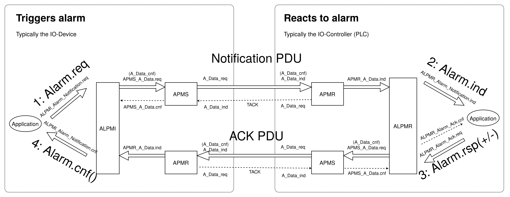

Implementation details
======================

This software stack is written in C, version C99.

For running the unit tests C++ (version C++11 or later) is required.

The primary p-net use case is to run in embedded devices, why there in general
are no functions to shut down the stack.

Application relations, communication relations and sessions
-----------------------------------------------------------
An "Application Relation" (AR) is a connection to an IO-controller (PLC). An AR
consists of two "Communication Relations" (CR) for cyclic data; one input and
one output.

There might be multiple ARs, as several PLCs can use the same IO-device.
On the wire an AR is identified by an UUID (the ARUUID).
The first AR has AREP=1, next has AREP=2 etc.
Each AR has its own CMDEV state machine.

Each AR has two sessions. One session is used for incoming DCE/RPC communication via UDP,
and uses the main listening UDP socket.
That session is created at the first incoming Connect message, and is reused for
the subsequent messages.
A separate session is created for the outgoing CControl request to the IO-controller,
and it creates its own UDP socket.

For an incoming Read Implicit request a session is created, and then closed
after the response.

Each session has an input and output buffer, in order to be able to handle
fragmented messages (larger than a single Ethernet frame).
On the wire, the session is identified by the activity UUID in the DCE/RPC
header.

C header files
--------------
The header file ``pnet_export.h`` is generated by cmake. It ends up in
``build/include/pnet_export.h``.

Incoming frame PDU types
------------------------
* A_Data  Acyclic RTA_CLASS_1
* C_Data  Cyclic  RT_CLASS_1 or RT_CLASS_2 or RT_CLASS_3
* N_Data  RT_CLASS_UDP or RTA_CLASS_UDP
* P_Data  TimeStamped
* R_Data  RSI

Stack development helper functions
----------------------------------
Use ``pf_memory_contents_show()`` to show the contents of a buffer/memory area.

State machines
--------------

* ALPMI       Alarm Protocol Machine Initiator. Initiates alarm (for sending to IO-controller)
* ALPMR       Alarm Protocol Machine Responder. Responds to alarm (from IO-controller)
* APMR        Acyclic Protocol Machine Receiver. Receives high- and low priority alarm Ethernet frames from the IO-controller (both alarms triggered by IO-Controller, and ack to alarms we trigger)
* APMS        Acyclic Protocol Machine Sender. Sends alarm Ethernet frames to IO-controller (both alarms we trigger, and ack to alarms triggered by IO-Controller)
* CMDEV       Context Management protocol machine Device, handles connection establishment for IO-Devices.
* CMDMC       Multicast communication between IO devices via DCP Identify messages.
* CMINA       Context Management Ip and Name Assignment protocol machine
* CMIO        Context Management Input Output protocol machine
* CMPBE       Context Management Parameter Begin End protocol machine. Optional.
* CMRDR       Context Management Read Record Responder protocol machine, responds to parameter read from the IO-controller
* CMRPC       Context Management RPC Protocol Machine, handles RPC communication via UDP
* CMSM        Context Management Surveillance protocol Machine, monitors the establishment of a connection.
* CMSU        Context Management Start Up machine. Starts other state machines, for example PPM and CPM
* CMWRR       Context Management Write Record Responder protocol machine
* CPM         Consumer Protocol Machine, for receiving cyclic data
* FSPM        Fieldbus Application Layer Service Protocol Machine. Interaction with user application; implements callbacks.
* PPM         Provider Protocol Machine, for sending cyclic data

Alarm related state machines
----------------------------

* APMS: It resends the Alarm DATA frame until it gets a TACK (transport acknowledge) back.
* APMR: Receives Alarm DATA frames, and sends TACK.
* ALPMI: Issues an Alarm Notification PDU, and waits for the Alarm ACK PDU.
* ALPMR: Hands over Alarm Notification PDU to the application, and waits for the application to respond to it. Waits for the sent ACK PDU to have its TACK.

Overview of alarm communication: (right-click "View Image" to magnify)

Sections in 61784-2 (profiles) describing alarms:

+---------------+------------------------------------------------------------------------+
| Section       | Description                                                            |
+===============+========================================================================+
| 7.1.3.2.1     | Communication (Class D should support one additional Device Access AR) |
+---------------+------------------------------------------------------------------------+

Sections in 61158-5-10 (services) describing alarms:

+---------------+-------------------------------------------------------------+
| Section       | Description                                                 |
+===============+=============================================================+
| 7.1.6.2       | Application process rules (for pull module alarm allowed)   |
+---------------+-------------------------------------------------------------+
| 7.3.1.3.6.2.5 | State table DEVSM (Multicast Communication Mismatch Alarm)  |
+---------------+-------------------------------------------------------------+
| 7.3.1.4.6.1.5 | Behavior on transitions (Alarms on IOCS/IOPS)               |
+---------------+-------------------------------------------------------------+
| 7.3.1.6       | Alarm class                                                 |
+---------------+-------------------------------------------------------------+
| 7.3.4.2.6.2   | Alarm Behavior (for diagnosis class)                        |
+---------------+-------------------------------------------------------------+

Sections in 61158-6-10 (protocol) describing alarms:

+---------------+-------------------------------------------------------------+
| Section       | Description                                                 |
+===============+=============================================================+
| 4.8.2         | RTA transfer syntax                                         |
+---------------+-------------------------------------------------------------+
| 4.8.4.2       | APMS                                                        |
+---------------+-------------------------------------------------------------+
| 4.8.4.3       | APMR                                                        |
+---------------+-------------------------------------------------------------+
| 5.1.2         | APDU abstract syntax                                        |
+---------------+-------------------------------------------------------------+
| 5.2.3         | Coding section related to RTA-SDU specific fields           |
+---------------+-------------------------------------------------------------+
| 5.2.9         | Coding section related to Alarm and Diagnosis Data          |
+---------------+-------------------------------------------------------------+
| 5.2.42.2.6    | AlarmCRBlockReq  Check incoming message                     |
+---------------+-------------------------------------------------------------+
| 5.2.42.3.5    | AlarmCRBlockRes  Check incoming message                     |
+---------------+-------------------------------------------------------------+
| 5.6.1         | ALPMI                                                       |
+---------------+-------------------------------------------------------------+
| 5.6.2         | ALPMR                                                       |
+---------------+-------------------------------------------------------------+
| 5.6.3.9       | CMPBE (Alarms during startup)                               |
+---------------+-------------------------------------------------------------+
| A.3           | Startup of Alarm transmitter and receiver                   |
+---------------+-------------------------------------------------------------+

Diagnosis
---------
Sections in 61784-2 (profiles) describing LLDP:

+---------------+-------------------------------------------------------------+
| Section       | Description                                                 |
+===============+=============================================================+
| 7.1.3.2.2.1   | Diagnosis (less than 65536 octets)                          |
+---------------+-------------------------------------------------------------+

Sections in 61158-5-10 (services) describing diagnosis:

+---------------+-------------------------------------------------------------+
| Section       | Description                                                 |
+===============+=============================================================+
| 7.1.4.5.3.6   | Channel and channel numbers                                 |
+---------------+-------------------------------------------------------------+
| 7.3.1.5.6.3   | Behavior of the Module Diff Block regarding diagnosis       |
|               | (failed parameterization)                                   |
+---------------+-------------------------------------------------------------+
| 7.3.1.6.1.2   | Alarm types attached to diagnosis ASE                       |
+---------------+-------------------------------------------------------------+
| 7.3.1.6.5.1   | "Alarm Notification" Lists of diagnosis data                |
+---------------+-------------------------------------------------------------+
| 7.3.2.5       | Observer class (PD Port Data Check etc)                     |
+---------------+-------------------------------------------------------------+
| 7.3.4         | Diagnosis ASE                                               |
+---------------+-------------------------------------------------------------+
| Annex F       | Precondition for Diagnosis                                  |
+---------------+-------------------------------------------------------------+

Sections in 61158-6-10 (protocol) describing diagnosis:

+---------------+-------------------------------------------------------------+
| Section       | Description                                                 |
+===============+=============================================================+
| 5.1.2         | APDU abstract syntax                                        |
+---------------+-------------------------------------------------------------+
| 5.2.3.2       | Coding of the field AlarmSpecifier                          |
+---------------+-------------------------------------------------------------+
| 5.2.4.4.3     | Grouping of DiagnosisData for the diagnosis records         |
+---------------+-------------------------------------------------------------+
| 5.2.9         | Coding section related to Alarm and Diagnosis Data          |
+---------------+-------------------------------------------------------------+

See also the "Diagnosis for Profinet" Guideline published by the Profinet
organisation.

For general discussions on diagnosis usage, see the section "A.6 PROFINET
Diagnosis" in the "Specification for GSDML" document.

An array of PNET_MAX_DIAG_ITEMS diagnosis items is available for use. Each
subslot uses a linked list of diagnosis items, and stores the index to the
head of its list.

Logbook
-------
For details, see:

* Profinet 2.4 Services, section 7.3.6
* Profinet 2.4 Protocol, section 5.2.38 "Coding section related to logbook"
* "Specification for GSDML", section 8.26 "LogBookEntryItem"
  (allowed error codes)

FSPM - Fieldbus application layer Service Protocol Machine
----------------------------------------------------------
Stores the user-defined configuration, and calls the user-defined callbacks.
Create logbook entries. Reads and writes identification & maintenance records.

CMRPC - Context Management RPC device protocol machine
------------------------------------------------------
Handles the DCE/RPC UDP communication in the start up phase, especially these
messages:

* connect
* release
* DControl ("Parameter end" is sent to IO-Device)
* CControl ("Application ready" is sent to IO-Controller)
* parameter read (Uses CMRDR)
* parameter write

Incoming UDP packets are parsed by ``pf_cmrpc_dce_packet()``, which also
prepares the return UDP packet. This is done by putting together incoming
fragments and then calling ``pf_cmrpc_rpc_request()``.

On DCE RPC connect requests the function ``pf_cmrpc_rm_connect_ind()`` is
called, and it will create a DCE RPC connect response. It will also trigger
these user callbacks:

 * ``pnet_exp_module_ind()``
 * ``pnet_exp_submodule_ind()``
 * ``pnet_connect_ind()``
 * ``pnet_state_ind()`` with PNET_EVENT_STARTUP

The function ``pf_cmrpc_rm_write_ind()`` is called for incoming (parameter)
write request messages, and it will trigger the ``pnet_write_ind()`` user
callback for certain parameters.
Other parameters are handled by the stack itself.

Incoming control (DControl) requests are handled by
``pf_cmrpc_rm_dcontrol_ind()`` which typically triggers these user callbacks:

* ``pnet_dcontrol_ind()`` with PNET_CONTROL_COMMAND_PRM_END
* ``pnet_state_ind()`` with PNET_EVENT_PRMEND

When the IO-device is sending a request to an IO-Controller (and expects a
response) a new separate session is started.

Incoming CControl responses are handled by ``pf_cmrpc_rm_ccontrol_cnf()``,
which will trigger these user callbacks:

* ``pnet_state_ind()`` with PNET_EVENT_DATA.
* ``pnet_ccontrol_cnf()``

Show current details on the CMRPC state machine::

   pf_cmrpc_show(0xFFFF);

Explicit AR = The incoming RPC request has same AR UUID as an existing AR.

DCP
---
Handles these DCP messages:

* Set
* Get
* Ident
* Hello

Flashes a LED on reception of the "Set request" DCP message with suboption
"Signal".

CMINA - Context Management Ip and Name Assignment protocol machine
------------------------------------------------------------------
This state machine is responsible for assigning station name and IP address.
Does factory reset when requested by IO-controller.

States:

* SETUP
* SET_NAME
* SET_IP
* W_CONNECT

Helps handling DCP Set and DCP Get requests.

CMRDR - Context Management Read record Responder protocol machine
-----------------------------------------------------------------
Contains a single function ``pf_cmrdr_rm_read_ind()``, that handles
RPC parameter read requests.

Triggers the ``pnet_read_ind()`` user callback for some values.
Other values, for example the Identification & Maintenance (I&M)
values, are handled internally by the stack.

This state machine is used by CMRPC.

CMWRR - Context Management Write Record Responder protocol machine
------------------------------------------------------------------
Handles RPC parameter write requests.
Triggers the ``pnet_write_ind()`` user callback for some values.

CMDEV - Context Management protocol machine Device
--------------------------------------------------
This handles connection establishment for IO-Devices.

For example pulling and plugging modules and submodules in slots and
subslots are done in this file. Also implements handling connect, release,
CControl and DControl.

States:

* POWER_ON, Data initialization. (Must be first)
* W_CIND, Wait for connect indication (in the connect UDP message)
* W_CRES, Wait for connect response from app and CMSU startup.
* W_SUCNF, Wait for CMSU confirmation.
* W_PEIND, Wait for PrmEnd indication (in the DControl UDP message)
* W_PERES, Wait for PrmEnd response from app.
* W_ARDY, Wait for app ready from app.
* W_ARDYCNF, Wait for app ready confirmation from controller.
* WDATA, Wait for established cyclic data exchange.
* DATA, Data exchange and connection monitoring.
* ABORT, Abort application relation.

Implements these user functions (via ``pnet_api.c``):

* ``pnet_plug_module()``
* ``pnet_plug_submodule()``
* ``pnet_pull_module()``
* ``pnet_pull_submodule()``
* ``pnet_application_ready()`` Triggers the ``pnet_state_ind()`` user callback with PNET_EVENT_APPLRDY.
* ``pnet_ar_abort()``

Show the plugged modules and sub-modules, and number of bytes sent and received
for subslots::

   pf_cmdev_device_show();

Show current state for CMDEV state machine::

   pf_cmdev_ar_show(p_ar);

CMSM - Context Management Surveillance protocol Machine
-------------------------------------------------------
The CMSM component monitors the establishment of a connection. Once the
device enters the DATA state this component is done.

This is basically a timer, which has two states; IDLE and RUN. If not stopped
before it times out, the stack will enter PNET_EVENT_ABORT state.
The timer returns to state IDLE at timeout. Typically the timeout setting is
around 20 seconds (can be adjusted by the IO-Controller).

The timer is started on PNET_EVENT_STARTUP (at the connect request message),
and stopped at PNET_EVENT_DATA.

It also monitors these response and indication messages:

* Read
* Write
* DControl

It starts the timer at sending the "response" message, and stops the timer
when the "indication" message is received.

CPM - Consumer Protocol Machine
-------------------------------
Receives cyclic data. Monitors that the incoming data fulfills the protocol,
and that the timing of incoming frames is correct. Stores incoming data into a
buffer.

Several instances of CPM can be used in parallel.

States:

* W_START Wait for initialization
* FRUN
* RUN Running

If there is a timeout in the RUN state, it will transition back to state
W_START.

Implements these user functions (via ``pnet_api.c``):

* ``pnet_output_get_data_and_iops()``
* ``pnet_input_get_iocs()``

Triggers the ``pnet_new_data_status_ind()`` user callback on data status
changes (not on changes in the data itself).

PPM - Provider Protocol Machine
-------------------------------
Sends cyclic data.

States:

* W_START
* RUN

Implements these user functions (via ``pnet_api.c``):

* ``pnet_input_set_data_and_iops()``
* ``pnet_output_set_iocs()``
* ``pnet_set_primary_state()``
* ``pnet_set_redundancy_state()``
* ``pnet_set_provider_state()``

Relevant sections in 61158-6-10 (protocol):

+---------------+-------------------------------------------------------------+
| Section       | Description                                                 |
+===============+=============================================================+
| 4.5.3         | "WorkingClock"                                              |
+---------------+-------------------------------------------------------------+
| 4.7.2.1.2     | "Coding of the field CycleCounter"                          |
+---------------+-------------------------------------------------------------+
| 4.7.4.2       | "Provider protocol machine" PPM                             |
+---------------+-------------------------------------------------------------+
| 4.12.4.5      | "Send list control"                                         |
+---------------+-------------------------------------------------------------+
| 5.2.5.58      | "Coding of the field SendClockFactor"                       |
+---------------+-------------------------------------------------------------+
| 5.2.5.59      | "Coding of the field ReductionRatio"                        |
+---------------+-------------------------------------------------------------+

Block reader and writer
-----------------------
The files ``pf_block_reader.c`` and ``pf_block_writer.c`` implement functions
for parsing and writing data in buffers.

ETH
---
Registers and invokes frame handlers for incoming raw Ethernet frames.

Module diff block
-----------------
Informs about differences between expected and plugged modules,
and also about diagnosis in modules etc. The information for each submodule
is indicated by bit fields in a 16-bit number.

Relevant sections in 61158-5-10 (services):

+--------------------------+--------------------------------------------------+
| Section                  | Description                                      |
+==========================+==================================================+
| 7.3.1.5.5.5 - 7.3.1.5.6  | "Read Module Diff Block for one AR"              |
+--------------------------+--------------------------------------------------+

Relevant sections in 61158-6-10 (protocol):

+---------------+-------------------------------------------------------------+
| Section       | Description                                                 |
+===============+=============================================================+
| 5.1.2         | "APDU abstract syntax"                                      |
+---------------+-------------------------------------------------------------+
| 5.2.5.65      | "Coding of the field SubmoduleState"                        |
+---------------+-------------------------------------------------------------+
| 5.2.42.3.6    | "ModuleDiffBlock"                                           |
+---------------+-------------------------------------------------------------+

LLDP - Link Layer Discovery Protocol
------------------------------------
Sections in 61784-2 (profiles) describing LLDP:

+---------------+-------------------------------------------------------------+
| Section       | Description                                                 |
+===============+=============================================================+
| 7.1.4.6       | Link layer discovery protocol (Transmission times)          |
+---------------+-------------------------------------------------------------+
| 7.1.11        | Conformance class behaviors (LLDP MIBs)                     |
+---------------+-------------------------------------------------------------+

Sections in 61158-5-10 (services) describing LLDP:

+---------------+-------------------------------------------------------------+
| Section       | Description                                                 |
+===============+=============================================================+
| 6.3.13.2      | IEEE 802.1AB class specification (LLDP)                     |
+---------------+-------------------------------------------------------------+
| 6.3.13.3      | IEEE 802.1AB service specification (LLDP)                   |
+---------------+-------------------------------------------------------------+
| 7.3.3.3       | Communication Interface Management class (LLDP blocking)    |
+---------------+-------------------------------------------------------------+
| 7.3.3.10      | MIB class (LLDP MIB)                                        |
+---------------+-------------------------------------------------------------+

Sections in 61158-6-10 (protocol) describing LLDP:

+---------------+-------------------------------------------------------------+
| Section       | Description                                                 |
+===============+=============================================================+
| 4.11          | Link layer discovery (LLDP abstract & transfer syntax)      |
+---------------+-------------------------------------------------------------+
| 4.16.6        | MIB cross reference (LLDP MIB)                              |
+---------------+-------------------------------------------------------------+
| 4.16.8        | LLDP EXT MIB (found in Annex U)                             |
+---------------+-------------------------------------------------------------+
| Annex U       | LLDP EXT MIB                                                |
+---------------+-------------------------------------------------------------+

Simple Network Management Protocol (SNMP)
-----------------------------------------

Sections in 61158-5-10 (services) describing SNMP:

+---------------+-------------------------------------------------------------+
| Section       | Description                                                 |
+===============+=============================================================+
| 6.3.5         | Simple network management ASE                               |
+---------------+-------------------------------------------------------------+
| 6.3.13.1      | IEEE 802.1AB ASE Overview                                   |
+---------------+-------------------------------------------------------------+
| 7.3.3.1       | Communication Interface Management ASE Overview             |
+---------------+-------------------------------------------------------------+
| 7.3.3.3.4     | Attributes for Communication Interface Management class     |
+---------------+-------------------------------------------------------------+
| 7.3.3.3.5     | Services for Communication Interface Management class       |
+---------------+-------------------------------------------------------------+
| 7.3.3.3.6.2   | Persistency                                                 |
+---------------+-------------------------------------------------------------+
| 7.3.3.3.6.5   | Station Name / IP address. DHCP requirement.                |
+---------------+-------------------------------------------------------------+
| 7.3.3.10      | MIB class                                                   |
+---------------+-------------------------------------------------------------+

Sections in 61158-6-10 (protocol) describing SNMP:

+---------------+-------------------------------------------------------------------------+
| Section       | Description                                                             |
+===============+=========================================================================+
| 4.11.3.18     | Coding section related to LLDP                                          |
+---------------+-------------------------------------------------------------------------+
| 4.16          | Simple network management                                               |
+---------------+-------------------------------------------------------------------------+
| 5.2.41        | Coding of the field SNMPControl, CommunityStringLength, CommunityString |
+---------------+-------------------------------------------------------------------------+
| Annex S       | List of supported MIBs                                                  |
+---------------+-------------------------------------------------------------------------+
| Annex U       | Extension to a MIB                                                      |
+---------------+-------------------------------------------------------------------------+
| Annex W.4     | Statistic counters in SNMPv1 and SNMPv2                                 |
+---------------+-------------------------------------------------------------------------+

Sections in 61784-2 (profiles) describing SNMP:

+---------------+-------------------------------------------------------------------------+
| Section       | Description                                                             |
+===============+=========================================================================+
| 7.1.4.11      | Simple Network Management Protocol (Community strings and timeouts)     |
+---------------+-------------------------------------------------------------------------+
| 7.1.11        | Conformance class behaviors (Mandatory MIBs)                            |
+---------------+-------------------------------------------------------------------------+

See also the "Topology and Asset Discovery" guideline published by the Profinet
organisation, and the list of supported OIDs in the test case specification
"Topology discovery check".

Dynamic Host Configuration Protocol (DHCP)
------------------------------------------
The GSDML file should have the ``AddressAssignment`` attribute set to
``"DCP;DHCP"`` if DHCP is a supported way to set the IP address.

During the ART Tester test case DCP_OPTIONS_SUBOPTIONS some aspects of DHCP
handling are tested, if the ``AddressAssignment`` attribute is set accordingly.

Sections in 61158-5-10 (services) describing DHCP:

+---------------+-------------------------------------------------------------+
| Section       | Description                                                 |
+===============+=============================================================+
| 6.3.11.2      | DCP class specification                                     |
+---------------+-------------------------------------------------------------+
| 6.3.11.3      | DCP service specification                                   |
+---------------+-------------------------------------------------------------+
| 6.3.12        | Dynamic host configuration ASE                              |
+---------------+-------------------------------------------------------------+
| 7.3.3.3.6     | Communication Interface Management class - Behavior         |
+---------------+-------------------------------------------------------------+

Sections in 61158-6-10 (protocol) describing DHCP:

+---------------+-------------------------------------------------------------+
| Section       | Description                                                 |
+===============+=============================================================+
| 4.3.1.2       | DCP APDU abstract syntax                                    |
+---------------+-------------------------------------------------------------+
| 4.3.1.4       | Coding section of block fields                              |
+---------------+-------------------------------------------------------------+
| 4.15          | Dynamic host configuration                                  |
+---------------+-------------------------------------------------------------+
| 5.6.3.11      | "Context Management IP and Name Assignment" CMINA           |
+---------------+-------------------------------------------------------------+

Sections in 61784-2 (profiles) describing DHCP:

+---------------+-------------------------------------------------------------+
| Section       | Description                                                 |
+===============+=============================================================+
| 7.1.4.12      | "Dynamic Host Configuration Protocol" DHCP options          |
+---------------+-------------------------------------------------------------+

Media Redundancy Protocol (MRP)
-------------------------------

Sections in 61784-2-3 2021 (profiles) describing MRP:

+---------------+---------------------------------------------------------------+
| Section       | Description                                                   |
+===============+===============================================================+
| 4.2.3.3       | Media redundancy protocol (Max time and packet size)          |
+---------------+---------------------------------------------------------------+
| 4.2.5         | Media redundancy classes                                      |
+---------------+---------------------------------------------------------------+
| 4.2.3.13.2.4  | PDEV parameters (PDInterfaceMrpDataAdjust etc)                |
+---------------+---------------------------------------------------------------+
| 4.2.9.2       | Index (PDInterfaceMrpDataAdjust etc)                          |
+---------------+---------------------------------------------------------------+
| 4.4.4.2.8     | Basic network topology dependency on Redundancy recovery time |
+---------------+---------------------------------------------------------------+
| 4.5.3.1.5     | Options (Services for Class B, "MRP is an optional service")  |
+---------------+---------------------------------------------------------------+

IEC 61158-5-10 2021 (services) describing MRP:

+---------------+---------------------------------------------------------------+
| Section       | Description                                                   |
+===============+===============================================================+
| 6.3.9.2       | RTC class specification (for MRP in Profinet class C)         |
+---------------+---------------------------------------------------------------+
| 6.3.9.3.3     | PPM Activate (for MRP in Profinet class C)                    |
+---------------+---------------------------------------------------------------+
| 6.3.9.3.9     | CPM Set RedRole (for Profinet class C)                        |
+---------------+---------------------------------------------------------------+
| 6.3.9.3.10    | CPM Activate (for MRP in Profinet class C)                    |
+---------------+---------------------------------------------------------------+
| 6.3.11.4.2    | Set (RESET_COMMUNICATION_PARAMETER)                           |
+---------------+---------------------------------------------------------------+
| 6.3.13.2      | IEEE 802.1AB class specification (LLDP PnioMRPPortStatus)     |
+---------------+---------------------------------------------------------------+
| 6.3.14        | **Media redundancy ASE**                                      |
+---------------+---------------------------------------------------------------+
| 6.3.19        | Fragmentation ASE (MRP frames are not fragmented)             |
+---------------+---------------------------------------------------------------+
| 7.3.1.6.1.2   | Alarm types attached to diagnosis ASE                         |
+---------------+---------------------------------------------------------------+
| 7.3.1.7.6.1.1 | Read (References to 7.3.3.9.5)                                |
+---------------+---------------------------------------------------------------+
| 7.3.1.7.6.2.1 | Write (References to 7.3.3.9.5)                               |
+---------------+---------------------------------------------------------------+
| 7.3.2.5.2     | Relations (Mismatch)                                          |
+---------------+---------------------------------------------------------------+
| 7.3.2.5.5     | Services (References to 7.3.3.9.5)                            |
+---------------+---------------------------------------------------------------+
| 7.3.3.3.5.2   | Read PD Real Data (References to 7.3.3.9.5)                   |
+---------------+---------------------------------------------------------------+
| 7.3.3.3.5.3   | Read PD Expected Data (References to 7.3.3.9.5)               |
+---------------+---------------------------------------------------------------+
| 7.3.3.7       | IEEE 802.1Q class (Yellow Time for conformance class C and D) |
+---------------+---------------------------------------------------------------+
| 7.3.3.9       | **Media Redundancy class**                                    |
+---------------+---------------------------------------------------------------+
| 7.3.3.11.7    | MRP-MIB (for SNMP)                                            |
+---------------+---------------------------------------------------------------+
| 7.4.2         | Network topology                                              |
+---------------+---------------------------------------------------------------+
| Annex F       | Preconditions for channel error type                          |
+---------------+---------------------------------------------------------------+

Sections in 61158-6-10 2021 (protocol) describing MRP:

+---------------+---------------------------------------------------------------+
| Section       | Description                                                   |
+===============+===============================================================+
| 4.2.2.4       | Coding of the field LT (0x88E3 for MRP)                       |
+---------------+---------------------------------------------------------------+
| 4.6           | Media redundancy                                              |
+---------------+---------------------------------------------------------------+
| 4.11.2.2      | LLDP APDU abstract syntax                                     |
+---------------+---------------------------------------------------------------+
| 4.11.3        | LLDP transfer syntax                                          |
+---------------+---------------------------------------------------------------+
| 5.1.2         | APDU abstract syntax (RecordDataRead + RecordDataWrite)       |
+---------------+---------------------------------------------------------------+
| 5.2.8.5       | Coding of the field ExtChannelErrorType                       |
+---------------+---------------------------------------------------------------+
| 5.2.12.3.23   | Coding of the field LinkState                                 |
+---------------+---------------------------------------------------------------+
| 5.2.12.10     | Coding section related to Media Redundancy                    |
+---------------+---------------------------------------------------------------+
| Annex S       | List of supported MIBs                                        |
+---------------+---------------------------------------------------------------+
| Annex V       | Cross reference to the IEC 62439-2                            |
+---------------+---------------------------------------------------------------+
| Annex W       | Maintaining statistic counters for Ethernet (mandatory)       |
+---------------+---------------------------------------------------------------+

It is possible to read and write MRP parameters via DCE-RPC, using the index
range 0x8050-0x8057. It uses these blocks:

=================================== ========================================================
Block                               Description
=================================== ========================================================
PDInterfaceMrpDataReal (read only)  Actual interval time and frame count setting.
PDInterfaceMrpDataAdjust            Setting of interval time and frame count.
PDInterfaceMrpDataCheck             Two booleans whether to check Domain UUID and set alarm
PDPortMrpDataAdjust                 Setting of MRP instance and UUID values
PDPortMrpDataReal (read only)       Actual MRP instance and UUID values
MrpManagerParams
MrpClientParams
MrpRingStateData
MrpInstanceDataAdjustBlock
MrpInstanceDataRealBlock
PDPortMrpIcDataAdjust               For interconnection ring
PDPortMrpIcDataCheck                For interconnection ring
PDPortMrpIcDataReal (read only)     For interconnection ring
=================================== ========================================================

The MRP client uses a state machine with these states:

* Power_On
* AC_STAT1. Waiting for the first Ethernet port.
* DE_IDLE. First port available. This will be named the primary port.
* PT. Temporary state when both ports just have been available.
  Send MRP_LinkChange frames. The UpTimer is running.
* PT_IDLE. Normal condition where both ports are available.
* DE. Temporary state when one port is lost. Send MRP_LinkChange frames. The
  DownTimer is running.

A MRP client has three settings; the delay between frames at port down, the
corresponding delay at port_up and the number of frames to send.
The client state is controlled by the state of the links (as given by the
Ethernet hardware) and incoming MRP_TopologyChange frames. It will update or
clean the forwarding table, set ports to BLOCKED or FORWARDING and it will
send MRP_LinkChange frames to the MRP manager.

A separate state machine is used to keep track of the time until the forwarding
table should be cleaned (as given in the incoming MRP_TopologyChange frame).

A MRP client should support these services:

* Start MRC:  UUID, port IDs, VLAN ID, intervals, count, Blocked supported
* Stop MRC: UUID
* Read MRC: UUID. Returns current values.

See the standard IEC 62439-2 for details on how to implement the MRP protocol.

The Linux kernel has support for the MRM and MRC roles since version 5.8. A
user space daemon is available at https://github.com/microchip-ung/mrp/

Legacy startup mode
-------------------
The startup mode is parsed at connect. It uses legacy start up mode when
this value is set to false::

   p_ar->ar_param.ar_properties.startup_mode

Section 17 "Startup Mode" in the guideline "PROFINET IRT Engineering" discusses
the differences between legacy and advanced startup modes.

Sections in 61784-2 (profiles) describing Legacy Startup mode:

+---------------+-------------------------------------------------------------+
| Section       | Description                                                 |
+===============+=============================================================+
| 7.1.9.2       | "Index" ARFSUDataAdjust (0xE050)                            |
+---------------+-------------------------------------------------------------+

Sections in 61158-5-10 (services) describing Legacy Startup mode:

+---------------+-------------------------------------------------------------+
| Section       | Description                                                 |
+===============+=============================================================+
| 7.3.1.3.4     | "Attributes" Allowed values for Startup Mode and for CM     |
|               | Initiator Activity Timeout Factor. The fields "IR Info      |
|               | Block", "SR Info Block", "Redundancy Info" and "List of     |
|               | AR Vendor Blocks" only in advanced startup mode.            |
+---------------+-------------------------------------------------------------+
| 7.3.1.3.5.1.2 | "Connect" Usage of "IR Info Block" , "SR Info Block" and    |
|               | "AR Server Block"                                           |
+---------------+-------------------------------------------------------------+
| 7.3.1.3.5.11  | "Read Expected Fast Startup Data" Only in legacy mode, and  |
|               | only for fast startup.                                      |
+---------------+-------------------------------------------------------------+
| 7.3.1.3.5.12  | "Write Expected Fast Startup Data" Only in legacy mode, and |
|               | only for fast startup.                                      |
+---------------+-------------------------------------------------------------+
| 7.3.1.3.6.3   | "IO controller during startup" Record data ARFSUDataAdjust  |
|               | (0xE050) supported only for legacy mode                     |
+---------------+-------------------------------------------------------------+
| 7.3.1.4.4     | "Attributes" RT Class and startup mode combinations         |
+---------------+-------------------------------------------------------------+

Sections in 61158-6-10 (protocol) describing Legacy Startup mode:
(search for "startupmode")

+---------------+-------------------------------------------------------------+
| Section       | Description                                                 |
+===============+=============================================================+
| 5.1.2         | "APDU abstract syntax" IODConnectReq with StartupMode:=1    |
+---------------+-------------------------------------------------------------+
| 5.2.4.4.4     | "Record index" Index 0xE050 ARFSUDataAdjust                 |
+---------------+-------------------------------------------------------------+
| 5.2.42.2.4    | "ARBlockReq" Checking of CMInitiatorActivityTimeoutFactor   |
+---------------+-------------------------------------------------------------+
| 5.6.3.1.1     | "General" Use Profinet v 2.2 for Legacy startup mode.       |
+---------------+-------------------------------------------------------------+
| 5.6.3.3.4     | "CMSU state table" Legacy startup mode implemented in CMSU, |
|               | PPM and CPM.                                                |
+---------------+-------------------------------------------------------------+
| Figure A.2    | Startup in advanced mode                                    |
+---------------+-------------------------------------------------------------+
| Figure B.2    | Startup in legacy mode                                      |
+---------------+-------------------------------------------------------------+

Conformance class D
-------------------

7.1.3.2.1 Communication (Class D should support one additional Device Access AR)

Messages and function calls at startup
--------------------------------------

+------------------+--------------------+-----------------------+--------------------------------------------+-------------------------------------+
| | Incoming       | | Outgoing         | | CMDEV               |  Application                               | Other                               |
| | message        | | message          | | state               |                                            |                                     |
+==================+====================+=======================+============================================+=====================================+
| Connect req      |                    |                       |                                            |                                     |
+------------------+--------------------+-----------------------+--------------------------------------------+-------------------------------------+
|                  |                    |                       | pnet_exp_module_ind()                      |                                     |
+------------------+--------------------+-----------------------+--------------------------------------------+-------------------------------------+
|                  |                    |                       | pnet_exp_submodule_ind()                   |                                     |
+------------------+--------------------+-----------------------+--------------------------------------------+-------------------------------------+
|                  |                    |                       | pnet_connect_ind()                         |                                     |
+------------------+--------------------+-----------------------+--------------------------------------------+-------------------------------------+
|                  |                    | W_CRES                |                                            |                                     |
+------------------+--------------------+-----------------------+--------------------------------------------+-------------------------------------+
|                  |                    |                       |                                            | PPM starts sending cyclic data      |
+------------------+--------------------+-----------------------+--------------------------------------------+-------------------------------------+
|                  |                    |                       |                                            | PF_CPM_STATE_FRUN                   |
+------------------+--------------------+-----------------------+--------------------------------------------+-------------------------------------+
|                  |                    | W_SUCNF               |                                            |                                     |
+------------------+--------------------+-----------------------+--------------------------------------------+-------------------------------------+
|                  |                    |                       | pnet_connect_ind() with PNET_EVENT_STARTUP |                                     |
+------------------+--------------------+-----------------------+--------------------------------------------+-------------------------------------+
|                  |                    |                       |                                            | CMSM timer started                  |
+------------------+--------------------+-----------------------+--------------------------------------------+-------------------------------------+
|                  |                    |                       | pnet_new_data_status_ind()                 |                                     |
+------------------+--------------------+-----------------------+--------------------------------------------+-------------------------------------+
|                  |                    |                       |                                            | PF_CPM_STATE_RUN                    |
+------------------+--------------------+-----------------------+--------------------------------------------+-------------------------------------+
|                  |                    | W_PEIND               |                                            |                                     |
+------------------+--------------------+-----------------------+--------------------------------------------+-------------------------------------+
|                  | Connect resp       |                       |                                            |                                     |
+------------------+--------------------+-----------------------+--------------------------------------------+-------------------------------------+
| Write req        |                    |                       |                                            |                                     |
+------------------+--------------------+-----------------------+--------------------------------------------+-------------------------------------+
|                  |                    |                       | pnet_write_ind()                           |                                     |
+------------------+--------------------+-----------------------+--------------------------------------------+-------------------------------------+
|                  | Write resp         |                       |                                            |                                     |
+------------------+--------------------+-----------------------+--------------------------------------------+-------------------------------------+
| DControl req     |                    |                       |                                            |                                     |
+------------------+--------------------+-----------------------+--------------------------------------------+-------------------------------------+
|                  |                    | W_PERES               |                                            |                                     |
+------------------+--------------------+-----------------------+--------------------------------------------+-------------------------------------+
|                  |                    |                       | pnet_dcontrol_ind()                        |                                     |
+------------------+--------------------+-----------------------+--------------------------------------------+-------------------------------------+
|                  |                    | W_ARDY                |                                            |                                     |
+------------------+--------------------+-----------------------+--------------------------------------------+-------------------------------------+
|                  |                    | (PRMEND)              |                                            |                                     |
+------------------+--------------------+-----------------------+--------------------------------------------+-------------------------------------+
|                  |                    |                       | pnet_connect_ind() with PNET_EVENT_PRMEND  |                                     |
+------------------+--------------------+-----------------------+--------------------------------------------+-------------------------------------+
|                  |                    |                       | Run pnet_input_set_data_and_iops()         |                                     |
+------------------+--------------------+-----------------------+--------------------------------------------+-------------------------------------+
|                  | DControl resp      |                       |                                            |                                     |
+------------------+--------------------+-----------------------+--------------------------------------------+-------------------------------------+
|                  |                    |                       | Run pnet_application_ready()               |                                     |
+------------------+--------------------+-----------------------+--------------------------------------------+-------------------------------------+
|                  |                    | (APPLRDY)             |                                            |                                     |
+------------------+--------------------+-----------------------+--------------------------------------------+-------------------------------------+
|                  |                    |                       | pnet_connect_ind() with PNET_EVENT_APPLRDY |                                     |
+------------------+--------------------+-----------------------+--------------------------------------------+-------------------------------------+
|                  | CControl req       |                       |                                            |                                     |
+------------------+--------------------+-----------------------+--------------------------------------------+-------------------------------------+
|                  |                    | W_ARDYCNF             |                                            |                                     |
+------------------+--------------------+-----------------------+--------------------------------------------+-------------------------------------+
| CControl resp    |                    |                       |                                            |                                     |
+------------------+--------------------+-----------------------+--------------------------------------------+-------------------------------------+
|                  |                    | WDATA                 |                                            |                                     |
+------------------+--------------------+-----------------------+--------------------------------------------+-------------------------------------+
|                  |                    |                       | pnet_ccontrol_cnf()                        |                                     |
+------------------+--------------------+-----------------------+--------------------------------------------+-------------------------------------+
|                  |                    |                       | pnet_connect_ind() with PNET_EVENT_DATA    |                                     |
+------------------+--------------------+-----------------------+--------------------------------------------+-------------------------------------+
|                  |                    | DATA                  |                                            |                                     |
+------------------+--------------------+-----------------------+--------------------------------------------+-------------------------------------+

Useful functions
----------------
Show lots of details of the stack state::

   pnet_show(net, 0xFFFF);

Coding rules
------------
In order to be platform independent, use ``CC_ASSERT()`` instead of ``assert()``.
Use ``ASSERT()`` for rt-kernel-specific code.

Include headers in sorted groups in this order:

* Interface header (Corresponding to the .c file)
* Headers from same project
* Headers from the operating system
* Standard C headers

New files should have the rt-labs standard header comment, with description of
the license and "Copyright YYYY rt-labs AB, Sweden."

Avoid "Yoda conditions"::

    if (3 == a) { /* ... */ }

Use C-style comments in C files, C or C++ comments in C++ files::

   /* C style comment */

   // C++ style comment

Declare (and initialize) internal variables in the beginning of a function.

Function names should start with the file name, for example functions in
``src/common/pf_ppm.c`` are named ``pf_ppm_xxx``.

Typically functions should return 0 on success and -1 on error.

Name functions and variables using "snake_case", for example
``pf_lldp_get_chassis_id ()`` and ``min_device_interval``.

Avoid to start pointer names with ``p_``. It can be useful in some special situations
but we will gradually remove those names from the p-net stack.

For error handling, the use of ``goto`` is acceptable.

If possible, avoid the modulo operator as it is slow on some platforms.

Instead of::

   if (have_dhcp == true){...}
   if (!have_dhcp){...}

use::

   if (have_dhcp){...}
   if (have_dhcp == false){...}

(Note that this not yet is fully implemented in the stack.)

Run clang-format on staged files before committing::

    $ git add .
    $ git clang-format

This will format the commit using clang-format. Examine and stage
modified files before finalizing the commit.

Static code analyzer
--------------------
To install the clang static analyzer tool::

   sudo apt-get install clang-tools

Run it using::

   rm -rf build
   scan-build cmake -B build
   scan-build -o clangreports make -C build -j4

The resulting HTML reports will end up in the ``clangreports`` subdirectory.

Workflow
--------
We have chosen to host the code on Github to ease the collaboration between
users and different developers, and we take advantage of the standard
Github workflow:

* Open a Github issue on https://github.com/rtlabs-com/p-net/ for each
  separate bug found.
* Fork the repository to your own account on Github, and make a local
  clone on your laptop.
* Create a branch with a descriptive name.
* Commit your fix to the branch. Add the line ``Closes #123`` (for example)
  in the commit message, to indicate which Github issue it closes.
* Push the branch to your Github account.
* Create a pull request to https://github.com/rtlabs-com/p-net
* After review the fix will be merged.
