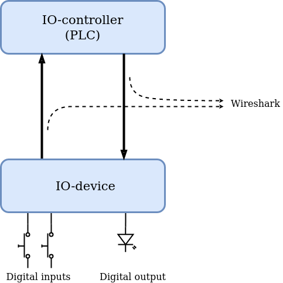

.. _tutorial:

Tutorial
========
In this tutorial we will run the p-net Profinet device stack and its
sample application on a Raspberry Pi, which is an embedded Linux board.
You can optionally connect two LEDs and two buttons to the Raspberry Pi
for easier interaction with the sample application.

We will use a second Raspberry Pi as a PLC (Programmable Logic Controller =
IO controller) running Codesys soft PLC.

Necessary hardware to complete the tutorial:

* 1 Raspberry Pi as IO-device
* 1 Raspberry Pi as IO-controller (alternatively a Siemens PLC).
* 1 Ethernet switch
* 3 Ethernet cables

Optional hardware:

* Keyboard, mouse and monitor for the Raspberry Pi running as IO-device. If
  this not is available it is helpful with a USB-to-serial cable for talking
  to the Raspberry Pi (as it will automatically change IP address now and then).
* LEDs and buttons for connecting to the Raspberry Pi running as IO-device.

It will take approximately 30 minutes to get p-net running on a Raspberry Pi.
After this the sample application will wait for incoming connects.
An additional hour is required to get another Raspberry Pi up and running
as an IO-controller (PLC), and to study the sample application data.

Sample app description
----------------------
The sample application implements a Profinet IO-device, having an
IO-module with 8 digital inputs and 8 digital outputs. The example uses
two buttons connected to inputs and one LED connected to one of the outputs
(we call this the "data LED").

A second LED is connected as the Profinet "Signal LED", which can be flashed in
order to identify a particular IO-device if you have many devices.

The LED1 ("data LED") on the IO-device is controlled by the IO-controller
(PLC), and is normally flashing.  With Button1 on the IO-device it is
possible to tell the PLC to turn on and off the flashing of the LED.

Button2 triggers sending an alarm from the IO-device to the PLC.

* Button1: Setting cyclic data value
* Button2: Trigger alarm, setting diagnosis etc
* LED1: Data LED
* LED2: Signal LED

The resulting Ethernet traffic can be studied (see below).

Notes to advanced users
-----------------------
The IO-device sample application can be running on:

* Raspberry Pi (as described in this tutorial)
* Some other embedded Linux board
* A Linux laptop (or a Linux guest in Virtualbox)
* An embedded board running an RTOS, such as RT-kernel

Instead of a Codesys soft PLC running on a second Raspberry Pi, you can
use a Siemens Simatic PLC. See another page of this documentation.

Available files
---------------
The ``samples/pn_dev`` directory in the p-net repository contains the source code
for this example. It also contains a GSD file (written in GSDML), which tells
the IO-controller how to communicate with the IO-device.

Those parts of the sample application that are dependent on whether you run
Linux or an RTOS are located in ``src/ports``.

Modules and slots
-----------------
Slots are locations where you can put modules.

The GSDML file for the sample app defines these modules:

+----------------------+-------------------------------+----------------------------------+
| Module               | Input data (to IO-controller) | Output data (from IO-controller) |
+======================+===============================+==================================+
| 8 bit in + 8 bit out | 1 byte                        | 1 byte                           |
+----------------------+-------------------------------+----------------------------------+
| 8 bit in             | 1 byte                        |                                  |
+----------------------+-------------------------------+----------------------------------+
| 8 bit out            |                               | 1 byte                           |
+----------------------+-------------------------------+----------------------------------+

There are 4 slots for the sample app (in addition to slot 0 which is used by the
DAP module), and for this sample app any of the modules fit in any of
the slots 1 to 4.

In this example we will use the "8 bit in + 8 bit out" module in slot 1.

Set up the IO-device Raspberry Pi for running p-net
---------------------------------------------------
As the PLC typically will change the IP address of the IO-device,
we recommend that you connect a keyboard, mouse and monitor to the Raspberry
Pi running the p-net sample application. Alternatively you can use a
USB-to-serial cable to communicate with the Raspberry Pi from your laptop.

To setup Raspbian on a Raspberry Pi, and optionally connect buttons and LEDs,
see :ref:`prepare_raspberry`.

A LED is controlled by the Linux sample app by writing to a file, for example
``/sys/class/gpio/gpio17/value``. A ``0`` or ``1`` will be written to the
file upon LED state changes. This is done by a script, for easy adaptation to
your hardware.

If you do not have a physical LED, you can use an alternate script that
writes to plain text files instead. Usage is described below.

Install dependencies
--------------------
Your Raspberry Pi needs to be connected to Internet via LAN or WiFi to be
able to download software.

In order to compile p-net on Raspberry Pi, you need a recent version of
``cmake``. Install it::

    sudo apt update
    sudo apt install snapd
    sudo reboot
    sudo snap install cmake --classic

Verify the installed version::

    cmake --version

Compare the installed version with the minimum version required for p-net
(see first page).

You also need ``git`` to download p-net. Install it using::

   sudo apt install git

Download and compile p-net
--------------------------
Create a directory::

    mkdir /home/pi/profinet/
    cd /home/pi/profinet/

Clone the source::

    git clone --recurse-submodules https://github.com/rtlabs-com/p-net.git

This will clone the repository with submodules.

Then create and configure the build::

    cmake -B build -S p-net

Build the code::

    cmake --build build --target install

We used the ``install`` target to install scripts for manipulating IP
settings, control LEDs etc.

Instead of controlling real LEDs, the default behavior is to write LED output
to regular files. If you have connected real LEDs to your Raspberry Pi,
enable the LED control script::

    mv build/set_profinet_leds build/set_profinet_leds.disabled
    mv build/set_profinet_leds.raspberrypi build/set_profinet_leds

Notes to advanced users
-----------------------
If you already cloned the repository without the ``--recurse-submodules``
flag then run this in the ``p-net`` folder::

    git submodule update --init --recursive

Alternate cmake command to also adjust some settings::

    cmake -B build -S p-net -DCMAKE_BUILD_TYPE=Debug -DBUILD_TESTING=OFF -DBUILD_SHARED_LIBS=ON -DUSE_SCHED_FIFO=ON

You can choose any name for the build folder, for instance if you want
to build different configurations.

You can use the ``-j`` flag to ``make`` if you like to enable parallel build.

Depending on how you installed cmake, you might need to run ``snap run cmake``
instead of ``cmake``.

It is possible to specify the location of the submodule repositories.
See the end of this page for details.

Run the sample application
------------------------------
Run the sample app in the build directory::

    cd build

Usage of the IO-device sample application:

.. code-block:: none

   pi@pndevice-pi:~/profinet/build$ ./pn_dev -h

   Sample application for p-net Profinet device stack.

   Wait for connection from IO-controller.
   Then read buttons (input) and send to controller.
   Listen for application LED output (from controller) and set application LED state.
   It will also send a counter value (useful also without buttons and LED).
   Button1 value is sent in the periodic data.
   Button2 cycles through triggering an alarm, setting diagnosis and creating logbook entries.

   Also the mandatory Profinet signal LED is controlled by this application.

   The LEDs are controlled by the script set_profinet_leds
   located in the same directory as the application binary.
   A version for Raspberry Pi is available, and also a version writing
   to plain text files (useful for demo if no LEDs are available).

   Assumes the default gateway is found on .1 on same subnet as the IP address.

   Optional arguments:
      --help       Show this help text and exit
      -h           Show this help text and exit
      -v           Incresase verbosity. Can be repeated.
      -f           Reset to factory settings, and store to file. Exit.
      -r           Remove stored files and exit.
      -g           Show stack details and exit. Repeat for more details.
      -i INTERF    Name of Ethernet interface to use. Defaults to eth0
      -s NAME      Set station name. Defaults to rt-labs-dev  Only used
                  if not already available in storage file.
      -b FILE      Path (absolute or relative) to read Button1. Defaults to not read Button1.
      -d FILE      Path (absolute or relative) to read Button2. Defaults to not read Button2.
      -p PATH      Absolute path to storage directory. Defaults to use current directory.

   p-net revision: 0.1.0+bb4177a

Enable the Ethernet interface and set the initial IP address::

    sudo ifconfig eth0 192.168.0.50 netmask 255.255.255.0 up

Run the sample application::

    sudo ./pn_dev -v

Example output:

.. code-block:: none

   pi@pndevice-pi:~/profinet/build$ sudo ./pn_dev -v

   ** Starting Profinet sample application 0.1.0+bb4177a **
   Number of slots:      5 (incl slot for DAP module)
   P-net log level:      3 (DEBUG=0, FATAL=4)
   App verbosity level:  1
   Number of ports:      1
   Network interfaces:   eth0
   Button1 file:
   Button2 file:
   Station name:         rt-labs-dev
   Management port:      eth0
   Physical port [1]:    eth0
   Current hostname:     pndevice-pi
   Current IP address:   192.168.0.50
   Current Netmask:      255.255.255.0
   Current Gateway:      192.168.0.1
   Storage directory:    /home/pi/profinet/build

   Profinet signal LED call-back. New state: 0
   Network script for eth0:  Set IP 192.168.0.50   Netmask 255.255.255.0   Gateway 192.168.0.1   Permanent: 1   Hostname: rt-labs-dev   Skip setting hostname: true
   Module plug call-back
   Pull old module.    API: 0 Slot:  0    Slot was empty.
   Plug module.        API: 0 Slot:  0 Module ID: 0x1
   Submodule plug call-back.
   Pull old submodule. API: 0 Slot:  0                   Subslot: 1      Subslot was empty.
   Plug submodule.     API: 0 Slot:  0 Module ID: 0x1    Subslot: 1 Submodule ID: 0x1 "DAP Identity 1"
                        Data Dir: NO_IO In: 0 Out: 0 (Exp Data Dir: NO_IO In: 0 Out: 0)
   Submodule plug call-back.
   Pull old submodule. API: 0 Slot:  0                   Subslot: 32768      Subslot was empty.
   Plug submodule.     API: 0 Slot:  0 Module ID: 0x1    Subslot: 32768 Submodule ID: 0x8000 "DAP Interface 1"
                        Data Dir: NO_IO In: 0 Out: 0 (Exp Data Dir: NO_IO In: 0 Out: 0)
   Submodule plug call-back.
   Pull old submodule. API: 0 Slot:  0                   Subslot: 32769      Subslot was empty.
   Plug submodule.     API: 0 Slot:  0 Module ID: 0x1    Subslot: 32769 Submodule ID: 0x8001 "DAP Port 1"
                        Data Dir: NO_IO In: 0 Out: 0 (Exp Data Dir: NO_IO In: 0 Out: 0)
   Waiting for connect request from IO-controller

The IP settings are stored to file. If you accidentally have run the application
when IP settings were wrong, use this command to remove the stored settings::

    sudo ./pn_dev -r

Now you have installed the sample app on the Raspberry Pi, congratulations!
In order to see it in action, you need to connect it to a PLC.

Set up the PLC
--------------
We suggest that you use Codesys soft PLC.
Install Raspberry Pi OS on the second Raspberry Pi. No serial cable or LEDs are
required.

See :ref:`prepare_raspberry` and :ref:`using-codesys` for how to set it up as an IO-controller (PLC).

Connect the two Raspberry Pi boards and your laptop via an Ethernet switch.

Print-out from Linux sample application when connecting to PLC
--------------------------------------------------------------

.. highlight:: none

This is the typical output from the Linux sample application at startup if
you enable verbose output::

   pi@pndevice-pi:~/profinet/build$ sudo ./pn_dev -v -b /sys/class/gpio/gpio22/value -d /sys/class/gpio/gpio27/value

   ** Starting Profinet sample application 0.1.0+bb4177a **
   Number of slots:      5 (incl slot for DAP module)
   P-net log level:      3 (DEBUG=0, FATAL=4)
   App verbosity level:  1
   Number of ports:      1
   Network interfaces:   eth0
   Button1 file:         /sys/class/gpio/gpio22/value
   Button2 file:         /sys/class/gpio/gpio27/value
   Station name:         rt-labs-dev
   Management port:      eth0
   Physical port [1]:    eth0
   Current hostname:     pndevice-pi
   Current IP address:   192.168.0.50
   Current Netmask:      255.255.255.0
   Current Gateway:      192.168.0.1
   Storage directory:    /home/pi/profinet/build

   Profinet signal LED call-back. New state: 0
   Network script for eth0:  Set IP 0.0.0.0   Netmask 0.0.0.0   Gateway 0.0.0.0   Permanent: 1   Hostname: rt-labs-dev   Skip setting hostname: true
   No valid default gateway given. Skipping setting default gateway.
   Module plug call-back
   Pull old module.    API: 0 Slot:  0    Slot was empty.
   Plug module.        API: 0 Slot:  0 Module ID: 0x1
   Submodule plug call-back.
   Pull old submodule. API: 0 Slot:  0                   Subslot: 1      Subslot was empty.
   Plug submodule.     API: 0 Slot:  0 Module ID: 0x1    Subslot: 1 Submodule ID: 0x1 "DAP Identity 1"
                        Data Dir: NO_IO In: 0 Out: 0 (Exp Data Dir: NO_IO In: 0 Out: 0)
   Submodule plug call-back.
   Pull old submodule. API: 0 Slot:  0                   Subslot: 32768      Subslot was empty.
   Plug submodule.     API: 0 Slot:  0 Module ID: 0x1    Subslot: 32768 Submodule ID: 0x8000 "DAP Interface 1"
                        Data Dir: NO_IO In: 0 Out: 0 (Exp Data Dir: NO_IO In: 0 Out: 0)
   Submodule plug call-back.
   Pull old submodule. API: 0 Slot:  0                   Subslot: 32769      Subslot was empty.
   Plug submodule.     API: 0 Slot:  0 Module ID: 0x1    Subslot: 32769 Submodule ID: 0x8001 "DAP Port 1"
                        Data Dir: NO_IO In: 0 Out: 0 (Exp Data Dir: NO_IO In: 0 Out: 0)
   Waiting for connect request from IO-controller

   Network script for eth0:  Set IP 192.168.0.50   Netmask 255.255.255.0   Gateway 0.0.0.0   Permanent: 0   Hostname: rt-labs-dev   Skip setting hostname: true
   No valid default gateway given. Skipping setting default gateway.
   Module plug call-back
   Pull old module.    API: 0 Slot:  1    Slot was empty.
   Plug module.        API: 0 Slot:  1 Module ID: 0x32
   Submodule plug call-back.
   Pull old submodule. API: 0 Slot:  1                   Subslot: 1      Subslot was empty.
   Plug submodule.     API: 0 Slot:  1 Module ID: 0x32   Subslot: 1 Submodule ID: 0x1 "Input 8 bits output 8 bits"
                        Data Dir: INPUT_OUTPUT In: 1 Out: 1 (Exp Data Dir: INPUT_OUTPUT In: 1 Out: 1)
   Connect call-back. AREP: 1  Status codes: 0 0 0 0
   Callback on event PNET_EVENT_STARTUP   AREP: 1
   New data status callback. AREP: 1  Data status changes: 0x35  Data status: 0x35
      Run, Valid, Primary, Normal operation, Evaluate data status
   Parameter write call-back. AREP: 1 API: 0 Slot:  1 Subslot: 1 Index: 123 Sequence:  2 Length: 4
   Bytes: 00 00 00 05
   Parameter write call-back. AREP: 1 API: 0 Slot:  1 Subslot: 1 Index: 124 Sequence:  3 Length: 4
   Bytes: 00 00 00 06
   Dcontrol call-back. AREP: 1  Command: PRM_END
   Callback on event PNET_EVENT_PRMEND   AREP: 1
   Set input data and IOPS for slot  0 subslot 1 "DAP Identity 1"  size 0 IOXS_GOOD
   Set input data and IOPS for slot  0 subslot 32768 "DAP Interface 1"  size 0 IOXS_GOOD
   Set input data and IOPS for slot  0 subslot 32769 "DAP Port 1"  size 0 IOXS_GOOD
   Set input data and IOPS for slot  1 subslot 1 "Input 8 bits output 8 bits"  size 1 IOXS_GOOD
   Set output IOCS         for slot  1 subslot 1 "Input 8 bits output 8 bits"
   Application will signal that it is ready for data.
   Callback on event PNET_EVENT_APPLRDY   AREP: 1
   Setting outputs to default values.
   Ccontrol confirmation call-back. AREP: 1  Status codes: 0 0 0 0
   Callback on event PNET_EVENT_DATA   AREP: 1
   Setting outputs to default values.

The exact output will depend on for example which modules you use when setting
up the PLC.

Input buttons and LEDs, or files for simulation
-----------------------------------------------
If you use plain files as output instead of LEDs, use this to study the file
for the "Data LED"::

    watch -n 0.1 cat /home/pi/profinet/build/pnet_led_1.txt

If you would like to use physical input buttons you must set up the
GPIO files for buttons properly first::

    echo 22 > /sys/class/gpio/export
    echo 27 > /sys/class/gpio/export

Then::

    sudo ./pn_dev -v -b /sys/class/gpio/gpio27/value -d /sys/class/gpio/gpio22/value

It is possible to use plain files as inputs instead of physical buttons::

   touch /home/pi/profinet/build/button1.txt
   touch /home/pi/profinet/build/button2.txt
   sudo ./pn_dev -v -b /home/pi/profinet/build/button1.txt -d /home/pi/profinet/build/button2.txt

Manually write ``1`` or ``0`` to a file to simulate the button press and
release::

   echo 1 > /home/pi/profinet/build/button1.txt
   echo 0 > /home/pi/profinet/build/button1.txt

If you only have one terminal, you need to run ``pn_dev`` in the background
to be able to run these commands.
That is done by adding a ``&`` at the end of the command to start ``pn_dev`` .
Later on kill the ``pn_dev`` process by using ``sudo pkill pn_dev``.

Study the resulting communication
---------------------------------
LED1 should be flashing by default. Press Button1 to toggle LED1
flashing.

By pressing Button2 you can trigger alarms, add diagnosis etc. See the
printout in the console.

On the page "Capturing and analyzing Ethernet packets" is a description given
on how to study the network traffic. If you are interested in the different
packets sent during startup or the cyclic data payload, see the page
"Sample app details".

Adjust log level
----------------
There is logging available in the p-net stack describing the interaction
with the PLC.

If you would like to change the p-net stack log level, run ``ccmake .`` in
the ``build`` directory. It will start a menu program. Move to the
LOG_LEVEL entry, and press Enter to change to DEBUG. Press ``c`` to save
and ``q`` to exit.

You need to re-build the project for the changes to take effect.

Next steps
----------
Great! You managed to get the sample application running.

Try flashing the Profinet signal LED. See description on the page "Using
Codesys soft PLC".

To enable automatic start of the sample application on power on, see the page
"Install Raspberry Pi OS on the Raspberry Pi".

For Profinet members the "ART tester" tool is available for conformance
testing. Run the conformance tests against the sample app to verify that the
stack is compliant. See a separate page on conformance testing in this
documentation.

To experiment with the SNMP features of conformance class B, see the page
"Network topology detection".

Now it is time for you to start developing your own applications. You can use
the sample app as a starting template.
Experiment by modifying the available modules, and the data types they send
and receive. Modify your GSDML file accordingly to explain the IO-device
behavior to the PLC configuration tool.

A separate page is available with a few ideas on how to write you application.
Remember to run the "ART tester" now and then to verify that you stay compliant.

Timing issues
-------------
If running on a Linux machine without realtime patches, you might face timeout
problems. It can look like::

   Callback on event PNET_EVENT_ABORT. Error class: 253 Error code: 6

where the error code most often is 5 or 6.
See the "Real-time properties of Linux" page in this document for solutions, and
the "Using Codesys soft PLC" page for workarounds.

Debug compilation issues
------------------------
To show more details on the compilation, use::

   cmake --build build -v

Troubleshooting
---------------
If you have network problems on your IO-device Raspberry Pi, re-run the
``ifconfig`` command given above.

If you have problems establishing a connection to your PLC, connect it
directly to your laptop and run the program Wireshark on the corresponding
Ethernet interface. Study the DCP and LLDP frames to see the current PLC
settings. See another page in this documentation for details on Wireshark usage.
The "Management Address" block in a LLDP frame shows the IP address of the PLC.
There are also other blocks describing the MAC address and the port ID.
You can find the expected IO-device station name in some DCP frames.

Advanced users: OSAL
--------------------
OSAL is a generic OS abstraction library that may be used by multiple
projects in a system. To avoid issues with multiple copies of the
library, possibly of conflicting versions, it has been moved to its
own repository.

``cmake-tools`` is a repository that contains common CMake utilities for
RT-Labs projects. It contains a CMake script ``AddOsal.cmake`` that
simplifies use of OSAL. It supports two different use-cases:

1) Automatic download and build of OSAL
^^^^^^^^^^^^^^^^^^^^^^^^^^^^^^^^^^^^^^^
During CMake configuration, if OSAL is not found in the system it will
be downloaded and built automatically. For most users this will be the
default.
Run CMake configuration by issuing e.g.::

    cmake -B build -S p-net

2) External OSAL
^^^^^^^^^^^^^^^^^^^^^^^^^^^^^^^^^^^^^^^
During CMake configuration, if OSAL is found then p-net will just link
against the external library.
CMake will find the external OSAL library if it is installed in a
default location such as ``/usr/include`` or ``/usr/local/include``. This
could be the case for a native build or a cross-compiled Linux system
with a staging folder.

CMake can also be told of the path to an installed version of OSAL by
setting ``Osal_DIR`` during configuration, like so::

    cmake -B build -S p-net -DOsal_DIR=/path/to/osal/install/cmake

The install folder is produced when running::

    make install

or similar in the OSAL build directory.
