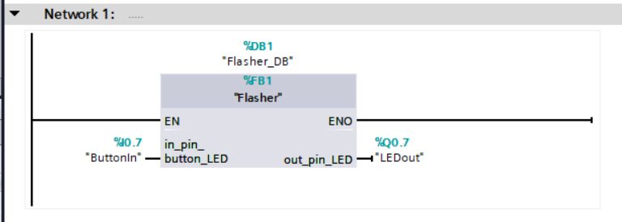
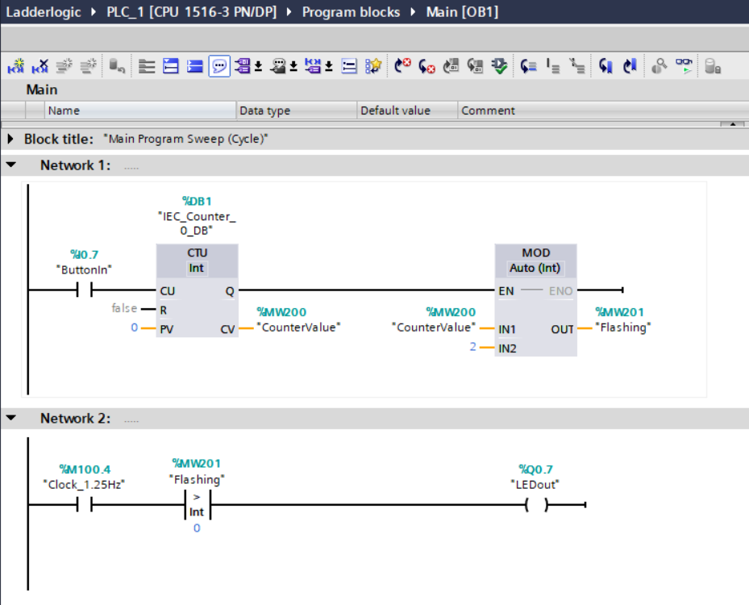
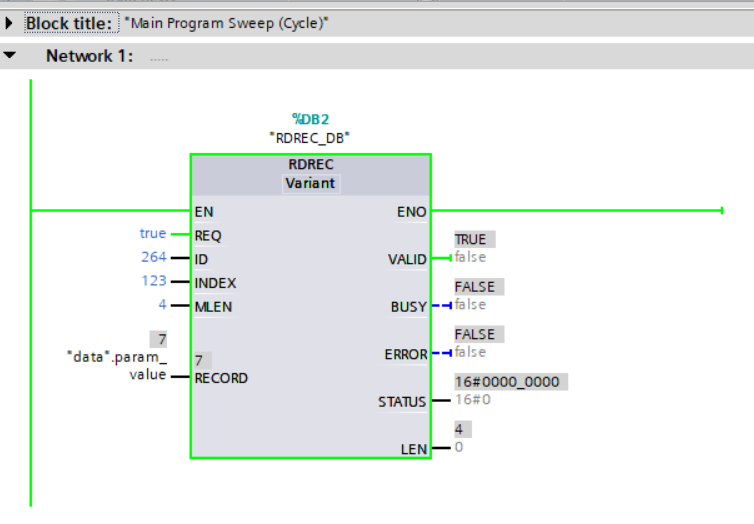

Using a Simatic PLC as IO controller
====================================
This have been tested with:

* Simatic S7-1200 CPU1215C DC/DC/DC 6ES7 215-1AG40-0xXB0 Firmware version 4.2

It uses a 24 V DC supply voltage.

Install Siemens TIA on a Windows PC
-----------------------------------
Install TIA (SIMATIC STEP 7 and WinCC) V15.1

Download the files from
`https://support.industry.siemens.com/cs/document/109752566/simatic-step-7-and-wincc-v15-trial-download-?dti=0&lc=en-US <https://support.industry.siemens.com/cs/document/109752566/simatic-step-7-and-wincc-v15-trial-download-?dti=0&lc=en-US>`_

* "SIMATIC STEP 7 Basic V15.1 is the easy-to-use engineering system for the
  small modular SIMATIC S7-1200 controller and the associated I/Os."
* "SIMATIC STEP 7 Professional V15.1 is the high-performance, integrated
  engineering system for the latest SIMATIC controllers S7-1500, S7-1200,
  S7-300, S7-400, WinAC and ET 200 CPU."

"SIMATIC WinCC is a supervisory control and data acquisition (SCADA) and
human-machine interface (HMI) system from Siemens."
See https://en.wikipedia.org/wiki/WinCC

Download "WinCC Professional". Use all files from "DVD 1 Setup". The "DVD 2"
files are not necessary.

The installer is split in a number of files, each 2 GByte.
Put the files in a directory on your Windows PC.
To start the installation, double-click the exe file. Restart of your computer
is required.

To show installed software version, use the "Portal view" and the "Start" tab
to the left of the screen. Click "Installed software".

After installation, make sure "PROFINET IO protocol (DCP/LLDP)" is enabled
for your Ethernet interface on your laptop. Otherwise you will have problems
communicating to Profinet devices. Remember however that this setting is
interfering with the "ART Tester" compliance verification tool, so disable
it before starting the "ART Tester" on your laptop.

Using Siemens TIA on a Windows PC: Add devices
----------------------------------------------
Start the application by searching for "TIA portal" in the Windows start menu.

In the start screen, select "Create new project" and enter the details.
Also on the start screen, select "Devices and networks", "Add new device" and
select your PLC model (a CPU that will act as IO-controller).
If you only know the series of your PLC, but not the exact model, then select
for example "Controller" > "SIMATIC S7-1200" > "CPU" > "Unspecified CPU 1200" >
"6ES7 2XX-". Click Add. In the "Device view" you will be notified that the
device not is specified. Click "detect". Make sure your PLC is powered on.
Select "PN/IE" and your Ethernet interface and "Start search". Mark the found
PLC and click "Detect".

Import a GSD file by using the menu "Options > Manage GSD files". Browse to
the directory with your GSD file. Mark the line with the file, and click
"Install".

In the project view, in the left menu select the PLC and the subitem "Device
configuration". Click the "Network view" tab. At the right edge open the
"Hardware catalog". Select "Other field devices" > Profinet IO > I/O >
RT-Labs > "P-Net Samples" > "P-Net Sample App".
Double-click it, and it will appear in the main window.

Use the "Network view" tab, and right-click "Not assigned" on the rt-labs-dev
icon. Select "Assign to new IO-controller" and "PLC_1.PROFINETinterface_1".

Set IP addresses and connect physically
---------------------------------------
Connect to the Siemens PLC directly via an Ethernet cable to your laptop. For
the Simatic S7-1200 PLC you can use any of the two X1 RJ45 connectors. Your
laptop should have a manual IP address in the same subnet range as the PLC
(first three groups in IP address should be the same). Changing the subnet
mask size does not seem to have an impact.

In the project view, in the left menu select the PLC and the subitem "Device
configuration". In the "Properties" tab, use the "General" sub-tab. Select
"PROFINET interface [X1]" and "Ethernet addresses". Enter the IP address
``192.168.0.100`` for the PLC. The subnet mask should be ``255.255.255.0``
and subnet "PN/IE_1".
Right-click the icon of the PLC, and select "Go online". Use type of
interface "PN/IE", your Ethernet network card and "Direct at slot 1 X1".
Select "Show accessible devices" in the dropdown.  Click "Start search".
The table should be updated with "Device type" = "CPU 1215C..."
if the connection is OK.

To enter the IP-address of the IO-device, go to "Device view" for the IO-device
and click the IO-device icon. in the "Properties" tab, select the "General"
sub-tab. Select
"PROFINET interface [X1]" and "Ethernet addresses". Enter the IP address
``192.168.0.50`` for the IO-device.
Also in the “PROFINET interface [X1]” section, set the IO cycle update time
to "Set update time manually" and select 16 ms. (Depending on your hardware
you can try faster updates later on).

Add modules to IO-device
------------------------
In the device view, select the "rt-labs-dev" device (by using the dropdown).
Add a module to the "Device overview" tab. That is done by dragging a module
from the "Hardware catalog", which is located to the right of screen.
The modules are found in "Other field devices" > Profinet IO > I/O > rt-labs >
rt-labs dev > Module. Drop the module in the correct slot row in the "Device
overview table". For the tutorial use a "DIO 8xLogicLevel" module in slot 1.
Only modules that fit in the respective slot seems to stick.

Run the application
-------------------
Connect one Ethernet cable between the PLC and the Windows laptop, and one
Ethernet cable between the PLC and the IO-device.

In the network view, right-click the PLC icon and select Compile > "Hardware
(rebuild all)". Repeat for Compile > "Software (rebuild all)". Then right-click
and select "Download to device" > "Hardware configuration".
Click Load in the pop-up window, and then Finish.
Repeat for "Download to device" > "Software (all)".

In the main menu, use Online > "Go online". In the right part of the screen,
use "Online tools" to see the PLC LED states and to go to RUN and STOP modes.

There will be cyclic communication regardless whether the PLC is in RUN or
STOP mode, and the run state information is available in the cyclic data.

No PLC program is necessary for the cyclic communication to take place, but
the payload from the PLC is probably zeros.

Change IO-device station name
-----------------------------
To change which IO-device name the PLC will connect to, use the network view
and click the icon of the IO-device.
Select and change the
name (on top row) in the icon. Do a download (hardware and software) to the
PLC. You can verify the result by looking at the PN-DCP frames in Wireshark.

Connect inputs and outputs
--------------------------
First find the address of the IO-device input byte and output byte. In the
“Device view” for the IO-device, look in the “Device overview” table.
The module "8 bits I
8 bits O" should appear (if previously inserted). Look for the I (input)
address and Q (output) address. The value can be for example 2.
Note that the IO-device must be connected to the PLC (as seen for example in
the network view) for the IO-device to have a PLC address assigned.

In the Project tree, select PLC_1 > PLC tags > Show all tags.
Create a new tag by clicking the first line and enter the name ``ButtonIn``.
Use "Default tag table" and DataType Bool. The address should be of operand
identifier "I" (input). Use address from the "Device view" as described above.
The bit number should be 7. This is written as ``%I2.7``.

Create a new tag ``LEDout``, also of Bool type. The bit number should be 7, so
the address should be for example ``%Q2.7``.

In order to study the values while running, you need to create an watch table.
In the Project tree, select PLC_1 > "Watch and force table" > "Add new watch
table". In the first empty line, double-click on the small icon on the Name field.
Select "ButtonIn". Repeat on next line with "LEDout".

When running, in order to study the values, connect to the PLC ("Online"). On
the "Watch table_1" page, click the small "Monitor all" icon. The values on the
page will be continuously updated.

Enter PLC program
-----------------
In the project tree, under PLC1 > Program blocks > Add new block. In the pop-up
window, select "Function block" and language SCL. Give it the name ``Flasher``.
Click "OK".

Note that Structured Control Language (SCL) is Siemens name for Structured Text
(ST) programming language.

In the "Flasher [FB1]" window upper part, add an input pin in the "Input"
section. Name it ``in_pin_button_LED``, and give it the data type Bool. In the
"Output" section, add a ``out_pin_LED`` which also should be Bool.
In the "Static" section, add:

* ``in_pin_button_LED_previous``: BOOL
* ``flashing``: BOOL
* ``oscillator_state``: BOOL
* ``oscillator_cycles``: Int

.. highlight:: none

In the program part of the window, insert this::

   #oscillator_cycles := #oscillator_cycles + 1;
   IF #oscillator_cycles > 400 THEN
      #oscillator_cycles := 0;
      #oscillator_state := NOT #oscillator_state;
   END_IF;

   IF #in_pin_button_LED = TRUE THEN
      IF #in_pin_button_LED_previous = FALSE THEN
         #flashing := NOT #flashing;
      END_IF;
      #out_pin_LED := TRUE;
   ELSIF #flashing = TRUE THEN
      #out_pin_LED := #oscillator_state;
   ELSE
      #out_pin_LED := FALSE;
   END_IF;
   #in_pin_button_LED_previous := #in_pin_button_LED;

In the "Main [OB1]" block, drag the "Flasher" icon to the "Network 1" line.
The icon is found in the left-side menu "PLC_1" > "Program blocks".
In the pop up asking for data block, select "Flasher_DB".

Connect the input on the "Flasher" block by double-clicking it. Select "ButtonIn".
Similarly connect the output to "LEDout".

The block "Flasher_DB [DB1]" has been created automatically. All the input-,
output- and static variables should appear inside it.

Compile the program and download it to the PLC. Verify that it works as
intended.

Adjust data cycle time and watchdog
-----------------------------------
In the device view, select the IO-device in the dropdown. Use the "Properties"
tag and "General" subtab. Select "PROFINET interface [X1]" > Advanced options
> Real time settings. Adjust "Update time" in ms and the watchdog time (which
is the allowed number of cycles without data before an alarm is triggered).

Adjust parameter values for a slot
----------------------------------
Use the "Device view" for the IO-device while you are offline from the PLC.
In the "Device overview", select the line for the relevant slot.
In the "Properties" tab and the "General" subtab, select "Module parameters".
A list of parameters is seen. Set the value in the text box.

Forcing output signals
----------------------
In the Project tree, select PLC_1 > "Watch and force table" > "Force table".
In the first empty line, double-click on the small icon on the Name field.
Select "LEDout". In the "Force value" column enter `TRUE`, and enable
the checkbox in the "F" column.
Go online, and then click the small "Start or replace forcing ..." icon.
Confirm in the pop-up window. To stop forcing the signal, press the small
"Stops forcing of ..." icon. Note that it not possible to download software
to the PLC while it is forcing output signals.

Opening an archived project
----------------------------
Open an archived project by using the project view menu Project > Retrieve
and select the ``.zap15_1`` file. Create a new empty folder when asked for
target directory.

Setting date and time on PLC
----------------------------
To set the time zone, in the "Device view" select Properties > General >
"Time of day". Use appropriate time zone.

To set the date and time, go online to the PLC.  In the Project tree on
the "PLC_1", right-click and select "Online & diagnostics". Use Functions >
"Set time".

Alarm when IO-device is terminated
----------------------------------
Approximately 7-8 ms after the last cyclic data frame is received from the
IO-device, the Simatic PLC will send an alarm frame about missing data (if
using default values).

The Wireshark tool will display::

    Status: Error: "RTA error", "PNIO", "RTA_ERR_CLS_PROTOCOL", "AR consumer DHT/WDT expired (RTA_ERR_ABORT)"

Display alarms in the PLC
-------------------------
While online, right-click on the PLC and enable "Receive alarms". Alarms are
then visible in "Device view" > Diagnostics > "Alarm display".

Show connection errors to IO-device
-----------------------------------
If you are connected to the PLC ("online"), then it is possible to see if
there are communication problems to the IO-device. In the project tree > PLC_1
> Distributed I/O > Profinet IO-System > rt-labs-dev. In case of communication
errors, the hover text on the small icon is showing "Not reachable".

Display diagnosis in the PLC
----------------------------
To see diagnosis in standard format for an IO-device, use the "Device view" for
the IO-device while you are "Online" with the PLC.
Press the "Go online" in the menu bar.
In the "Device overview"
there is a table of slots and subslot. A red icon will be shown for the slot
with the diagnosis. Double-click the icon. In the new window select
"Diagnostics" > "Channel diagnostics". The error will be described and it is
possible to see for which channel it is reported.

To see a list of previous communication failures for the PLC, make sure you
are online with the PLC. In the Project tree on the "PLC_1", right-click and
select "Online & diagnostics".
Select Diagnostics -> "Diagnostics buffer" in the left part of the new window.
A list of previous problems is seen. Click on relevant row to see details.

There is also a "Diagnosis status" page that shows a summary of the current
status.

Scan for devices from TIA portal
--------------------------------
In the "Portal view", click "Online & Diagnostics" and then "Accessible devices".
In the pop-up window, select "PN/IE" and the name of the Ethernet interface
of your laptop. Click "Start search".
You can flash a LED on your device by marking the relevant line in the
result table, and mark the "Flash LED" check-box.

To change network settings for a device, mark the relevant line in the table
of found devices, and click "Show". The "Project tree" will open, and under
"Online access" in the left menu, select the relevant Ethernet interface.
If necessary click "Update accessible devices". Select relevant found device,
and use the small triangle to access its "Online & diagnostics" button.
Double-click it. A new window will open, and in its "Functions" sections it is
possible to assign IP address and to assign Profinet device name.

It is also possible to reach the tool to scan for devices via the main top menu
Online > "Accessible devices".

Troubleshooting
---------------
Note that the PLC might complain if there is a non-Profinet switch between the
IO-device and the IO-controller. This is probably due to wrong port names in LLDP messages.

Replace a device or a PLC
-------------------------
To replace an IO-device or an IO-controller, right-click on it in the left
side menu and select "Change device". Follow the wizard.

Using the Echo module
---------------------
The echo module will receive an integer and a float from the PLC, and multiply them with a constant
value before sending them back to the PLC. The multiplier is module parameter, and can be adjusted
at startup. The integer is an unsigned 32 bit integer, and the float is a single precision float
(32 bits).

To test it, unplug any existing modules, and plug one Echo module into slot 1.

Check the resulting addresses for the inputs and outputs of the module (by looking in the
"Device overview"). Typically the addresses are "0..7" for both the input (I) and output (Q) addresses.

Assuming these addresses, add these tags:

============== =========== =======
Name           Data type   Address
============== =========== =======
EchoFloatIn    LReal       %ID0
EchoIntIn      UDInt       %ID4
EchoFloatOut   LReal       %QD0
EchoIntOut     UDInt       %QD4
============== =========== =======

In a program block, define these values:

======== =========== ============
Section  Name        Data type
======== =========== ============
Input    in_float    Real
Input    in_int      UDInt
Output   out_float   Real
Output   out_int     UDInt
Temp     temp_float  Real
Temp     temp_int    UDInt
======== =========== ============

and enter this program::

   #out_float := 1001.2345;
   #out_int := 16;

   #temp_float := #in_float;
   #temp_int := #in_int;

It is not clear why the IO data signals not are shown in the user interface.

Add the program block to the "Main" program block. Connect "in_float" to "EchoFloatIn" etc.

Add "EchoFloatIn" and the three other signals to the watch table.
Add "EchoFloatOut" and "EchoIntOut" to the Force table. See description elsewhere on how to force the values.

Start the PLC, and go online. Study the values sent to and from the IO-device.

Reload an GSDML file
--------------------
When the GSDML file is updated and needs to be reloaded in the Siemens environment:

1. Delete all devices in your project that are based on the GSDML that shall be changed.
2. Check the "Force" table.

   * Stop forcing all values.
   * Delete entries in table.

3. Open "Options/Manage general station description files"

   * In "Installed GSDs" tab, delete GSDML file
   * in "GSDs in the project", "Find unused GSDs" and delete

4. Save project
5. Restart TIA and add your updated GSDML file and recreate your device.
   If you you are still facing problems you can try repeat the described
   sequence and also completely remove all tags.

Factory reset of Simatic ET200SP CPU
------------------------------------
Use the mode switch on the front panel to do a factory reset. See the user
manual for details. This will reset also the IP address.

Connect the PLC to your laptop, and run Wireshark to figure out the IP address.
It is given inside the LLDP frame. Also the detailed model name, firmware
version etc are given in the LLDP frame.

Upgrade firmware on a Siemens PLC
---------------------------------
Select the proper firmware to use for your PLC from the Siemens downloads
page. With the latest firmware you need a recent version of the STEP7 software.
Download the file, which is in ``.zip`` format. Unzip the file.

In TIA Portal, right-click the PLC and select "Online and Diagnostics". In
the "Functions" sections, use "Firmware update". Browse to the downloaded file
(in ``.upd`` format) and start the update.

Using a Simatic ET200SP IO-device for conformance test
------------------------------------------------------
See the page on conformance testing in this documentation for hardware details.

This type of hardware is used when testing multiple-port IO-devices, to verify
that it is possible to communicate with other IO-devices via the ports of the
device-under-test.

You can also use this hardware for communication reference instead of the
p-net sample app. For that use case, configure the Simatic IO-device similarly
as described for the p-net sample application above. Select the proper device
from the hardware catalog in the STEP7 software.

In STEP7, add the digital output module (DQ) in slot 1 and the digital input
module (DI) in slot 2. The server module should be inserted into slot 3.

Step7 naming
------------

* DB - Data block for storage
* FB - Function block, that uses data blocks.
* FC - Function without any storage
* LGF - Library of general functions
* OB - Organisation block. A callback called by the PLC's operating system in different situations.

Data types in Step7
-------------------
A few of the available data types:

* Bool
* Int - 16 bit
* UInt - 16 bit unsigned
* DInt - 32 bit
* UDInt - 32 bit unsigned
* Word - 16 bits
* DWord - 32 bits
* Real - 32 bit floating point number

SCL programming basics
-----------------------
Line comments are written like this::

   // Line comment

Hexadecimal literals start with ``16#``.

Assignment::

   temporary_value := 0;

Running the sample application via a ladder logic PLC program
-------------------------------------------------------------
It is possible to program the PLC in the programming language "Ladder logic"
instead of in SCL.

In order to flash the LED we use an available clock bit. In the "Device view"
for the PLC, use the "Properties" tab and "General" sub-tab. Select "System
and clock memory", and enable the checkbox "Enable the use of clock memory
byte". Enter the value 100 in the "Address of clock memory byte" text box.
This results in the "Clock_1.25Hz" having the address ``%M100.4``.
For this change to take effect in the PLC, you need to compile the hardware
configuration and to download the hardware configuration to the PLC.

First create two internal (memory) tags via the left menu PLC_1 > "PLC tags" >
"Show all tags". Add a new tag "CounterValue" with data type "Int" and address
``%MW200``. Similarly a new tag "Flashing" with data type "Int" and address
``%MW201``.

With your program by using the left side menu "PLC_1" > "Program blocks" >
"Main [OB1]". In order to make the button toggle the state between off and
flashing, we will use a counter and the modulo operator.
From the right-side menu "Instructions" > "Basic instructions" > "Bit logic
operations" drag the "Normally open contact" icon to the "Network 1" line.
Double-click the question marks on top of the icon, and select "Button In".

Drag a "CTU" counter from Instructions" > "Basic instructions" > "Counter
operations". Accept the data block name in the pop-up window. Double-click the
question marks on the PV input and enter ``0``. Double-click the value connected
to the CV output, and select "CounterValue".

The last item on this network line is a modulo operator. You find it in
"Instructions" > "Basic instructions" > "Math functions" > "MOD".
For "IN1" use "CounterValue", and for "IN2" use ``2``. Connect the output to
"Flashing".

Insert a new network by using the small "Insert network" icon in the top of the
"Main [OB1]" window.  Add a "Normally open contact" which you use with
"Clock_1.25Hz", and then add a "Instructions" > "Basic instructions" >
"Comparator operations" > "CMP>". For the top row of question marks, use
"Flashing" and use ``0`` for the bottom row of question marks. Finally add a
"Instructions" > "Basic instructions" > "Bit logic operations" > "Assignment"
and connect it to "LEDout".

Compile and download the program to your PLC. Button1 on the sample app will
turn on and off the flashing of the LED1.

Reading parameter data from the sample app using ladder logic
-------------------------------------------------------------
Reading parameter data from the IO-device is done with the RDREC command.
It is a asynchronous PLC command, meaning that the command is started in
one PLC execution cycle and the result is available in some later PLC execution
cycle.

Find the ID of the relevant "DIO 8xLogicLevel" by using the left side menu
"PLC_1" > "PLC tags" > "Show all tags" and use the "System constants" tab.
The value for "rt-labs-dev~DIO 8xLogicLevel" can be for example 264.

Create a data block using the left side menu "PLC_1" > "Program blocks" >
"Add new block". Use a data block of type "Global DB" and name it "data".
In the block create these a tag "param_value" of type "UDInt.

In the "Main [OB1]" block, insert a RDREC block, and keep the default name. The
block is found in the right-side menu "Instructions" > "Extended instructions"
> "Distributed I/O".

The value at the REQ input should be ``true`` and MLEN (number of bytes to read)
should be ``4``. The INDEX input should be ``123`` as given in the sample app
GSDML file. For the ID input, use the value you did find out above.
Connect the outputs RECORD to ``"data".param_value``.

To study the result, compile and download the program to the PLC. Go online,
and enable monitoring by clicking the small glasses-icon. The parameter value
will be seen in the ladder logic diagram. The PLC will read out the parameter
value many times per second. The VALID and BUSY outputs are switching on
and off rapidly.

Reading parameter data from the sample app using the SCL language
-----------------------------------------------------------------
Create a new function block "RecReader" with language SCL.
In the "Static" section, add these tags:

* valid - Bool
* busy - Bool
* error - Bool
* status - DWord
* len - UInt

In the code part::

   "RDREC_DB_1"(REQ := TRUE,
               ID := 264,
               INDEX := 123,
               MLEN := 4,
               VALID => #valid,
               BUSY => #busy,
               ERROR => #error,
               STATUS => #status,
               LEN => #len,
               RECORD := "data".param_value);

In the "Main [OB1]" window, drag the "RecReader" block to the Network1 line.
Accept the name of the datablock.

The result is the same as above.

Using Siemens SinecPni (Primary Network Initialization)
-------------------------------------------------------
This is a tool for configuration of Profinet network equipment. Use it
to adjust the IP address of your PLC.

Download the program from the Siemens homepage, and unzip the file.
Start the program by double clicking the SinecPni executable.

To be able to change IP address on a Siemens PLC, make sure that the
"mode switch" on the front panel is in the "STOP" position.

Click the “Settings” tab, and enable “PROFINET devices” for “Scan Protocol”, and
click “Save”. On the “Device list” tab, click “Start network scan”.
Select the “S7-1500” line, and click “Configure Device”. Adjust the IP address
to ``192.168.0.100`` and netmask to ``255.255.255.0``.
Click “Load” to store the settings.

Setting up a Simatic HMI
------------------------
This example uses a "HMI KTP400 Basic", which is a 4 inch touch screen.
The sample application LED state will be shown on the screen. A
touch-screen button will start and stop the LED blinking on the IO-device (and
on the screen).

Make sure you have added your PLC to the project first.

Add a new tag to your PLC. In the left menu go to "PLC_1" > "PLC tags" >
"Show all tags". On an empty line add the name "ButtonHmiIn", and give it the
address ``%M1.1`` (which indicates that it is in-memory only).

In the "Portal view" select "Devices and networks" and "Add new device".
Click "HMI" and select the correct model in the tree view. Click "Add".
Follow the device wizard. When you reach the "Screens" setting use only the
default "Root" screen. For "System screens" enable these:

* Project information
* PLC system diagnostics
* System information

For "Buttons" select to use button area to the left.
Click "Finish".

In the "Device view" select the "HMI_1", and click on the image of the HMI.
In the "Properties" tab and "General" sub-tab select "PROFINET Interface [X1]" >
"Ethernet addresses". Set the IP address to ``192.168.0.51`` and subnet mask to
``255.255.255.0``.

In the left menu select "HMI_1" > "Screens" and double-click "Root screen".
The screen editor will be seen. Drag the "Welcome to HMI_1 ..." text box to
make place for other elements. From the Toolbox menu on the right side of the
screen drag a "Button" icon, found in the "Elements" section.
Double-click the button to modify its text to "Press Me!".

Select the button icon in the graphical editor, and select the "Properties" tab
and "Events" sub-tab. Select "Press" and on the "<Add function>" select
"System functions" > "Edit bits" > "Set bit". In the resulting line press the
icon with three dots, and select "PLC_1" > "PLC tags" > "Default tag table" >
"ButtonHmiIn".
Similarly for the "Release" use "Reset bit" for "ButtonHmiIn".

To modify the button color when pressed, use the "Animations" sub-tab. Use
"Display" and double-click "Add new animation". Select "Appearance", and in the
Tag field select "PLC_1" > "PLC tags" > "Default tag table" > "ButtonHmiIn".
The line "0" is already available, so add a line for the value "1". Modify the
background color to something different.

Add a LED to the screen by dragging a circle from the right side menu "Toolbox" >
"Basic objects". Select the circle and use the "Properties" "Animations" sub-tab.
Use the method described above to set the background color to black when the PLC
tag "LEDout" has the value 0, and red when it has the value 1.

Update the sample app PLC program to also take the button on the HMI screen
into account.

Compile the software for the HMI screen by right-clicking it in the "Device view",
and select Compile > "Hardware (rebuild all)" and then Compile > "Software
(rebuild all)". Then right-click on it and select "Download to device" >
"Software (all)". In the new window select "PN/IE" and your Ethernet interface.
Click "Start search" and select the device when it appears in the list. Click
"load".

Also compile and download hardware settings and software to the PLC.

Run the sample application. The state of the physical LED connected to your
Raspberry Pi will be reflected on the LED (drawn circle) on the HMI. Use
the touch screen button on the HMI to start and stop flashing of the LED.
